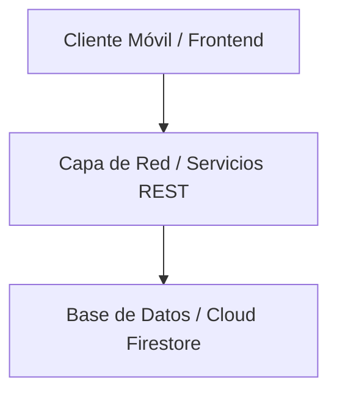

# [Título del Sistema o Módulo] - Documento de Especificación (spec.md)

| Metadato | Valor |
| :--- | :--- |
| **Identificador / Código** | `SPEC-001` |
| **Versión** | `1.0.0` |
| **Estado** | `Borrador / En Revisión / Aprobado` |
| **Fecha de Creación** | `AAAA-MM-DD` |
| **Última Actualización** | `AAAA-MM-DD` |
| **Responsables / Autores** | [Nombres o Roles] |

---

## 1. Resumen Ejecutivo y Objetivos

### 1.1 Declaración del Problema
[Describe el contexto del problema o necesidad técnica y de negocio que motiva esta especificación]

### 1.2 Objetivos Principales
- [Objetivo 1]
- [Objetivo 2]
- [Objetivo 3]

### 1.3 Alcance
- **En Alcance (In-Scope)**:
  - [Característica o capacidad incluida]
- **Fuera de Alcance (Out-of-Scope)**:
  - [Característica expresamente excluida para esta versión]

---

## 2. Marco Ético y Cumplimiento Normativo (Ethical Specification)

### 2.1 Principios Éticos Aplicados
- **Protección a Poblaciones Vulnerables**: Restricciones de edad (ej. validación +18), prevención de adicciones o consumo no deseado.
- **Transparencia Activa**: Notificaciones claras de advertencias de salud, procedencia de componentes y términos de servicio comprensibles.
- **Equidad y No Discriminación**: Accesibilidad para todo tipo de usuario y neutralidad de algoritmos.

### 2.2 Privacidad de Datos y Seguridad Ética
- **Minimización de Datos**: Solo recopilar la información estrictamente necesaria para la prestación del servicio.
- **Consentimiento Explícito**: Mecanismos de aceptación informada de políticas de privacidad y términos y condiciones.
- **Cifrado y Resguardo**: Protección de credenciales y datos de contacto en tránsito (HTTPS/TLS) y en reposo.

### 2.3 Matriz de Riesgos Éticos y Medidas de Mitigación
| Riesgo Ético Detectado | Nivel de Severidad | Medida de Mitigación Técnica / Operativa |
| :--- | :--- | :--- |
| Acceso de menores de edad | Crítica | Validación obligatoria de fecha de nacimiento y confirmación legal en registro. |
| Exposición indebida de credenciales | Alta | Transmisión bajo HTTPS y hashing de contraseñas. |
| Información confusa sobre productos | Media | Fichas técnicas detalladas con marca, stock y especificaciones claras. |

---

## 3. Especificación Técnica (Technical Specification)

### 3.1 Arquitectura del Sistema


### 3.2 Modelos de Datos y Esquemas
```text
Entidad: [NombreEntidad]
- campo1: Tipo (Restricciones / Validaciones)
- campo2: Tipo (Restricciones / Validaciones)
```

### 3.3 Contratos de API
| Método | Endpoint | Descripción | Body Request | Respuesta Exitosa |
| :--- | :--- | :--- | :--- | :--- |
| `GET` | `/recurso` | Lista recursos | N/A | `200 OK - List<Recurso>` |
| `POST` | `/recurso` | Crea recurso | `RecursoPayload` | `201 Created` |

### 3.4 Requerimientos No Funcionales (NFR)
- **Rendimiento**: Tiempo de respuesta menor a 5 ms en operaciones clave.
- **Disponibilidad**: Tolerancia a fallos de red con mensajes claros al usuario.
- **Compatibilidad**: Versiones de sistema operativo soportadas.

---

## 4. Experiencia de Usuario y Diseño de Interfaz (UI/UX)
- **Flujos de Usuario**: Pasos para completar la tarea principal.
- **Manejo de Estados**: Estados de carga (*Loading*), vacío (*Empty*), error (*Error*) y éxito (*Success*).
- **Accesibilidad**: Contraste cromático mínimo 4.5:1, etiquetas descriptivas para accesibilidad de pantalla (*contentDescription*).

---

## 5. Criterios de Aceptación (BDD)

### Escenario 1: [Nombre del Escenario]
- **Dado que (Given)**: [Condición inicial]
- **Cuando (When)**: [Acción del usuario]
- **Entonces (Then)**: [Resultado esperado del sistema]

---

## 6. Plan de Implementación y Métricas de Éxito
- **Hito 1**: [Entregable clave]
- **Hito 2**: [Entregable clave]
- **Métricas de Éxito**: [KPIs técnicos o de negocio esperados tras el despliegue]
