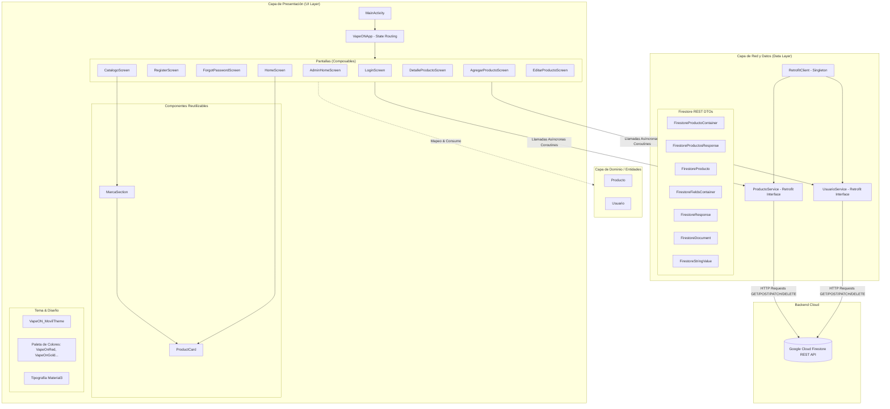
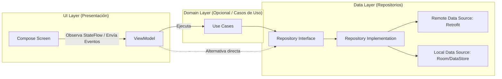

# Arquitectura del Sistema - VapeON Móvil 📱💨

Documento de especificación y diseño de arquitectura para la aplicación móvil **VapeON**, desarrollada para la plataforma Android utilizando **Kotlin** y **Jetpack Compose**.

---

## 1. Resumen Ejecutivo y Propósito

**VapeON Móvil** es una aplicación nativa para Android orientada al comercio electrónico y gestión de catálogo de productos de vapeo. Proporciona una experiencia de usuario fluida con soporte para dos perfiles de usuario principales:
- **Cliente**: Exploración de catálogo organizado por marcas (LifePod, Oxbar, Nexa), categorías, búsqueda y visualización de detalles.
- **Administrador**: Gestión completa del inventario (CRUD de productos: crear, listar, editar y eliminar) y acceso al panel administrativo.

---

## 2. Ficha Técnica y Stack Tecnológico

| Componente | Tecnología / Versión | Propósito |
| :--- | :--- | :--- |
| **Lenguaje de Programación** | Kotlin (v2.2.10) | Lenguaje base tipado y conciso con soporte para corrutinas. |
| **Plataforma Objetivo** | Android (minSdk 31, targetSdk 37, compileSdk 37) | Soporte nativo para versiones modernas de Android (Android 12+). |
| **Framework de Interfaz de Usuario** | Jetpack Compose (BOM 2026.02.01) | Paradigma declarativo y reactivo para construcción de interfaces. |
| **Sistema de Diseño** | Material Design 3 (Material3) | Componentes UI modernos (Cards, Scaffolds, Drawers, Buttons). |
| **Concurrencia y Asincronía** | Kotlin Coroutines (`rememberCoroutineScope`, `suspend`) | Operaciones de red no bloqueantes en hilos de fondo. |
| **Capa de Red HTTP** | Square Retrofit 2 (v2.9.0) + Gson Converter | Cliente REST tipado para consumir la API de base de datos. |
| **Base de Datos / Backend** | Google Cloud Firestore (REST API v1) | Almacenamiento NoSQL en la nube consumido vía HTTP REST. |
| **Gestor de Compilación** | Gradle con Kotlin DSL (`build.gradle.kts`) | Configuración y gestión modular de dependencias. |

---

## 3. Vista General del Patrón Arquitectónico

Actualmente, el proyecto implementa un modelo **Single-Activity Architecture** basado en componentes declarativos de **Jetpack Compose**, con gestión de estado local (*State Hoisting* y *Mutable State*) y comunicación directa con la API REST de Firestore mediante interfaces de **Retrofit**.

### 3.1 Diagrama de Arquitectura de la Solución



---

## 4. Desglose Detallado de Capas

### 4.1 Capa de Presentación (Presentation / UI Layer)

La capa de presentación es 100% declarativa y reactiva gracias a **Jetpack Compose**. Se estructura en:

1. **Actividad Principal (`MainActivity.kt`)**:
   - Actúa como el host único de la aplicación (`ComponentActivity`).
   - Habilita renderizado de borde a borde (`enableEdgeToEdge()`).
   - Envuelve la ejecución en la función raíz `VapeONApp()`.

2. **Controlador Central de Navegación (`VapeONApp.kt`)**:
   - Gestiona el estado de navegación de forma centralizada mediante `mutableStateOf("login")`.
   - Implementa *State Hoisting*: el estado de la pantalla activa y los objetos contextuales (`productoSeleccionado`, `productoEditar`) residen en `VapeONApp` y se transmiten a las pantallas como callbacks (`irRegistro`, `irHome`, `irAdmin`, `irCatalogo`, `volver`).

3. **Pantallas (`Screens`)**:
   - **Autenticación**:
     - `LoginScreen`: Validación de credenciales contra Firestore, distinción de roles (`ADMIN` vs `CLIENTE`), indicador de carga y navegación condicionada.
     - `RegisterScreen`: Formulario con validación de datos para alta de nuevos usuarios con rol predeterminado `CLIENTE`.
     - `ForgotPasswordScreen`: Flujo para solicitud de restablecimiento de contraseña.
   - **Vistas de Usuario / Cliente**:
     - `HomeScreen`: Landing page con categorías rápidas, barra de búsqueda y productos destacados.
     - `CatalogoScreen`: Vista principal con menú lateral deslizable (`ModalNavigationDrawer`), filtrado por marcas y navegación al detalle.
     - `DetalleProductoScreen`: Presentación de atributos completos del producto seleccionado.
   - **Vistas Administrativas**:
     - `AdminHomeScreen`: Panel de control para administradores con menú lateral y accesos directos de gestión.
     - `AgregarProductoScreen`: Formulario para registrar nuevos vapes en Firestore (`POST`).
     - `EditarProductoScreen`: Formulario precargado con datos del producto para actualización parcial (`PATCH`).

4. **Componentes Atómicos y Moleculares (`components/`)**:
   - `ProductCard.kt`: Tarjeta de producto que encapsula imagen, nombre, precio y botones de acción rápida administrativa (editar / eliminar con confirmación condicional).
   - `MarcaSection.kt`: Sección compuesta por un encabezado de marca y una lista horizontal optimizada (`LazyRow`) que itera sobre los `ProductCard`.

5. **Sistema de Tematización (`ui/theme/`)**:
   - `Color.kt`: Paleta cromática corporativa (Rojo `VapeOnRed: #ED2025`, Dorado `VapeOnGold: #EAA016`, Fondo oscuro `VapeOnBackground: #0D0E15`, Superficie `VapeOnSurface: #161822`).
   - `Theme.kt`: Configuración de temas `DarkColorScheme` / `LightColorScheme` adaptados a estética Dark Mode.
   - `Type.kt`: Jerarquía tipográfica estandarizada para títulos, subtítulos, campos de entrada y etiquetas.

---

### 4.2 Capa de Dominio y Modelos de Negocio (Domain Models)

Ubicada en `entities/`, define los modelos limpios desacoplados del formato de transporte de datos:

- **`Producto.kt`**:
  ```kotlin
  data class Producto(
      val id: String = "",
      val nombre: String,
      val marca: String,
      val precio: String,
      val stock: String,
      val descripcion: String
  )
  ```
- **`Usuario.kt`**:
  ```kotlin
  data class Usuario(
      val id: String = "",
      val nombre: String = "",
      val apellido: String = "",
      val telefono: String = "",
      val fechaNacimiento: String = "",
      val correo: String = "",
      val password: String = "",
      val rol: String = "CLIENTE" // "ADMIN" | "CLIENTE"
  )
  ```

---

### 4.3 Capa de Red y Acceso a Datos (Data & Network Layer)

En lugar de utilizar el SDK pesado de Firebase, el sistema se conecta a la **REST API oficial de Google Cloud Firestore**, lo cual reduce el peso del APK y permite un control fino de las solicitudes HTTP estándar.

#### 1. Configuración de Red (`RetrofitClient.kt`)
- Implementado como un `object` (patrón Singleton).
- URL base: `https://firestore.googleapis.com/v1/projects/dbvapeon/databases/(default)/documents/`.
- Conviertidor JSON: `GsonConverterFactory`.

#### 2. Servicios de Red (`services/`)
- **`ProductoService.kt`**:
  - `GET ("productos")`: Listado de todos los documentos en la colección.
  - `POST ("productos")`: Creación de un nuevo documento.
  - `PATCH ("productos/{id}")`: Actualización de atributos de un documento.
  - `DELETE ("productos/{id}")`: Eliminación física del documento.
- **`UsuarioService.kt`**:
  - `GET ("usuarios")`: Obtención de lista de usuarios para autenticación y gestión.
  - `GET ("usuarios/{id}")`: Consulta individual.
  - `POST ("usuarios")`: Registro de nuevo perfil.
  - `PATCH ("usuarios/{id}")`: Modificación de usuario.
  - `DELETE ("usuarios/{id}")`: Borrado de cuenta.

#### 3. Data Transfer Objects (DTOs)
Firebase Firestore estructura los campos JSON bajo nodos de tipo `fields: { campo: { stringValue: "..." } }`. El proyecto modela esta estructura mediante clases de soporte:
- `FirestoreStringValue`: Encapsula `{ stringValue: String }`.
- `ProductoFields` / `UsuarioFields`: Mapeo directo de campos de cada colección.
- `FirestoreProductosResponse` / `FirestoreResponse`: Envoltorio de colecciones de documentos.
- `FirestoreProductoContainer` / `FirestoreFieldsContainer`: Payload para operaciones `POST` y `PATCH`.

---

## 5. Seguridad y Control de Acceso Basado en Roles (RBAC)

El sistema implementa un control de acceso lógico en la capa de interfaz:
- En `LoginScreen`, al autenticar contra Firestore se evalúa el campo `rol` del usuario:
  - Si `rol == "ADMIN"`: Redirige a `AdminHomeScreen` y activa capacidades administrativas (`esAdmin = true`), habilitando botones para agregar, modificar y eliminar inventario.
  - Si `rol == "CLIENTE"`: Redirige a `HomeScreen` o al catálogo en modo solo lectura.

---

## 6. Estructura de Directorios del Código Fuente

```text
app/src/main/
├── AndroidManifest.xml                  # Manifiesto de Android (Permisos de Internet, Activity)
├── java/com/example/vapeon_movil/
│   ├── MainActivity.kt                  # Punto de entrada de la actividad Android
│   ├── VapeONApp.kt                     # Enrutador principal y gestor de pantallas
│   │
│   ├── LoginScreen.kt                   # Pantalla de inicio de sesión
│   ├── RegisterScreen.kt                # Pantalla de registro de usuario
│   ├── ForgotPasswordScreen.kt          # Pantalla de recuperación de contraseña
│   ├── HomeScreen.kt                    # Pantalla principal para clientes
│   ├── AdminHomeScreen.kt               # Pantalla principal para administradores
│   ├── CatalogoScreen.kt                # Catálogo general de productos y marcas
│   ├── DetalleProductoScreen.kt          # Vista a detalle de producto seleccionado
│   ├── AgregarProductoScreen.kt          # Formulario para nuevo producto
│   ├── EditarProductoScreen.kt           # Formulario para editar producto existente
│   │
│   ├── components/                      # Componentes reutilizables de UI
│   │   ├── ProductCard.kt               # Tarjeta de producto individual
│   │   └── MarcaSection.kt              # Fila horizontal con scroll por marca
│   │
│   ├── entities/                        # Entidades y modelos de dominio
│   │   ├── Producto.kt                  # Modelo de producto
│   │   └── Usuario.kt                   # Modelo de usuario
│   │
│   ├── services/                        # Servicios de red y contratos API
│   │   ├── ProductoService.kt           # Endpoints y DTOs de Firestore para productos
│   │   └── UsuarioService.kt            # Endpoints y DTOs de Firestore para usuarios
│   │
│   ├── ui/theme/                        # Sistema de diseño y tokens Material3
│   │   ├── Color.kt                     # Definición de colores oficiales
│   │   ├── Theme.kt                     # Configuración de MaterialTheme
│   │   └── Type.kt                      # Definición de tipografías
│   │
│   └── utils/                           # Utilidades y configuración global
│       └── RetrofitClient.kt            # Singleton de Retrofit para Firestore REST
│
└── res/                                 # Recursos visuales (íconos, drawables, strings)
```

---

## 7. Flujo de Datos y Operaciones Clave

### 7.1 Flujo de Autenticación
1. El usuario introduce correo y contraseña en [LoginScreen.kt](file:///d:/AppMovil_VapeOn/app/src/main/java/com/example/vapeon_movil/LoginScreen.kt).
2. Se activa una corrutina en `rememberCoroutineScope()`.
3. Se invoca `usuarioService.listarUsuarios()`.
4. Se busca coincidencia de credenciales en memoria sobre la lista de documentos.
5. Si es exitoso, se evalúa el rol (`ADMIN` / `CLIENTE`) y se dispara el callback de navegación correspondiente (`irAdmin()` o `irHome()`).

### 7.2 Flujo de Carga y Visualización de Catálogo
1. [CatalogoScreen.kt](file:///d:/AppMovil_VapeOn/app/src/main/java/com/example/vapeon_movil/CatalogoScreen.kt) ejecuta un `LaunchedEffect(Unit)` al componerse.
2. Llama a `productoService.listarProductos()`.
3. Transforma los DTOs (`FirestoreProducto`) a entidades limpias (`Producto`), extrayendo el ID desde la ruta del documento (`it.name.substringAfterLast("/")`).
4. Actualiza la variable de estado `productosFirebase`.
5. Filtra los productos por marca (`LifePood`, `Oxbar`, `Nexa`) y los renderiza en secciones independientes [MarcaSection.kt](file:///d:/AppMovil_VapeOn/app/src/main/java/com/example/vapeon_movil/components/MarcaSection.kt).

---

## 8. Recomendaciones para la Evolución de la Arquitectura (Roadmap a Clean Architecture + MVVM)

Para proyectos en crecimiento continuo, se recomienda transicionar la base actual hacia la arquitectura oficial recomendada por Google Android (**MVVM + Clean Architecture**):



### Pasos recomendados para la siguiente fase:
1. **Adopción de ViewModels**:
   - Extraer la lógica de red y estado de las pantallas Compose hacia clases `ViewModel` (usando `viewModelScope` y `StateFlow<UiState>`), evitando que recomposiciones innecesarias repitan llamadas HTTP o pierdan estado ante cambios de configuración.
2. **Capa de Repositorio (`Repository Pattern`)**:
   - Crear `ProductoRepository` y `UsuarioRepository` para abstraer la conversión de DTOs de Firestore a entidades de dominio y permitir almacenamiento en caché offline en el futuro (ej. Room Database).
3. **Navegación Formal con Jetpack Navigation**:
   - Reemplazar el bloque `when(pantallaActual)` de `VapeONApp.kt` por `NavHost` y `NavController` de `androidx.navigation:navigation-compose`, soportando historial de navegación (*BackStack*) nativo de Android.
4. **Inyección de Dependencias**:
   - Incorporar **Hilt** o **Koin** para inyectar automáticamente `Retrofit`, repositorios y `ViewModels`, desacoplando componentes y facilitando la creación de pruebas unitarias.
