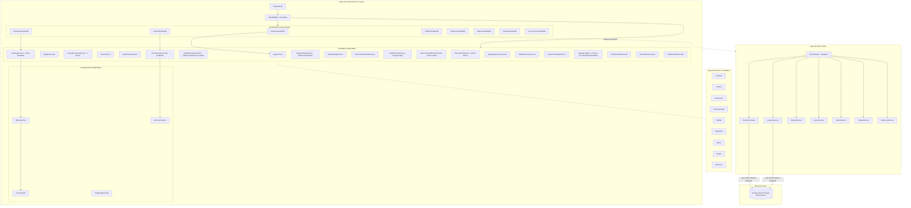

# Arquitectura del Sistema - VapeON Móvil 📱💨

Documento de especificación y diseño de arquitectura para la aplicación móvil **VapeON**, desarrollada para la plataforma Android utilizando **Kotlin** y **Jetpack Compose**.

---

## 1. Resumen Ejecutivo y Propósito

**VapeON Móvil** es una aplicación nativa para Android orientada al comercio electrónico y gestión de catálogo de productos de vapeo. Proporciona una experiencia de usuario fluida con soporte para dos perfiles de usuario principales:
- **Cliente**: Exploración de catálogo por marcas y filtros flotantes (RF12 / RF13), visualización exclusiva de productos con stock disponible (RNE01), ficha técnica con imágenes dinámicas por sabor, carrito de compras persistente localmente y proceso de checkout/pedidos con boleta electrónica troquelada e incremental.
- **Administrador**: Gestión completa del inventario (CRUD de productos: crear, listar, editar con conmutador de sabores `tieneSabor` y eliminar), supervisión de pedidos, gestión de la colección máster de sabores y marcas, y acceso al panel administrativo desde el menú lateral. **Sin acceso al carrito.**

---

## 2. Ficha Técnica y Stack Tecnológico

| Componente | Tecnología / Versión | Propósito |
| :--- | :--- | :--- |
| **Lenguaje de Programación** | Kotlin (v2.2.10) | Lenguaje base tipado y conciso con soporte para corrutinas. |
| **Plataforma Objetivo** | Android (minSdk 31, targetSdk 37, compileSdk 37) | Soporte nativo para Android 12+. |
| **Framework de UI** | Jetpack Compose (BOM 2026.02.01) | Paradigma declarativo y reactivo para UI. |
| **Sistema de Diseño** | Material Design 3 | Componentes UI modernos (Cards, Scaffolds, Drawers, Buttons). |
| **Gestión de Estado / MVVM** | `ViewModel` + `viewModelScope` + `mutableStateOf` | Estado observable que sobrevive rotaciones de pantalla. |
| **Concurrencia** | Kotlin Coroutines (`viewModelScope`, `suspend`) | Operaciones de red no bloqueantes en hilos de fondo. |
| **Capa de Red HTTP** | Square Retrofit 2 (v2.9.0) + Gson Converter | Cliente REST tipado para consumir la API de Firestore. |
| **Base de Datos / Backend** | Google Cloud Firestore (**REST API v1 — sin SDK nativo**) | Almacenamiento NoSQL en la nube vía HTTP REST puro. |
| **Persistencia Local** | `SharedPreferences` + `Gson` | Almacenamiento del carrito de compras local. |
| **Mapas** | Google Maps SDK for Android + `maps-compose` (v7.0.0) | Mapa a pantalla completa con marcador de la dirección de entrega. |
| **Gestor de Compilación** | Gradle con Kotlin DSL (`build.gradle.kts`) | Gestión modular de dependencias con version catalog. |

---

## 3. Patrón Arquitectónico — MVVM + Single Activity

El proyecto implementa **MVVM (Model-View-ViewModel)** dentro de una arquitectura **Single-Activity** con Jetpack Compose.

### 3.1 Diagrama de Arquitectura

```mermaid
graph TD
    subgraph UI_Layer ["Capa de Presentación (UI Layer)"]
        MA[MainActivity] --> VA[VapeONApp - Enrutador]

        subgraph ViewModels ["ViewModels (scope Activity)"]
            UVM[UsuarioViewModel]
            PVM[ProductoViewModel]
            CVM[CarritoViewModel]
            PED_VM[PedidoViewModel]
            SAB_VM[SaboresViewModel]
            MAR_VM[MarcasViewModel]
            TAR_VM[TarjetaViewModel]
            DIR_VM[DireccionesViewModel]
        end

        subgraph Screens ["Pantallas Composables"]
            LS[LoginScreen]
            RS[RegisterScreen]
            FPS[ForgotPasswordScreen - 3 Pasos]
            HS[HomeScreen]
            AHS[AdminHomeScreen]
            CS[CatalogoScreen - Filtros Flotantes]
            DPS[DetalleProductoScreen - Galería Dinámica por Sabor]
            CAR[CarritoScreen ★ solo CLIENTE]
            DES[DatosEntregaScreen - Boleta Incremental]
            MPS[MetodoPagoScreen]
            SDS[SeleccionDireccionScreen]
            VUS[VerUbicacionScreen - Google Maps]
            SUB[SeleccionarUbicacionScreen - punto exacto]
            DIRS[DireccionesScreen - CRUD cliente]
            ADIR[AgregarDireccionScreen]
            EDIR[EditarDireccionScreen]
            STS[SeleccionTarjetaScreen]
            TSR[AgregarTarjeta - 4 Pasos con VisualTransformation]
            SAB_ADM[SaboresAdminScreen]
            MAR_ADM[MarcasAdminScreen]
            PED_ADM[PedidosAdminScreen]
        end

        subgraph Components ["Componentes Reutilizables"]
            PC[ProductCard]
            MS[MarcaSection]
            ICC[ItemCarritoCard]
            ISV[ImagenSaborView]
        end

        VA --> ViewModels
        VA --> Screens
        UVM --> LS
        PVM --> CS
        CVM --> CAR
        CS --> MS --> PC
        CAR --> ICC
    end

    subgraph Domain_Layer ["Capa de Dominio / Entidades"]
        ENT_PROD[Producto]
        ENT_USER[Usuario]
        ENT_ITEM[ItemCarrito]
        ENT_RES[ResumenPago]
        ENT_PED[Pedido]
        ENT_SAB[SaborItem]
        ENT_MAR[Marca]
        ENT_TAR[Tarjeta]
        ENT_DIR[Direccion]
    end

    subgraph Data_Layer ["Capa de Red y Datos"]
        RC[RetrofitClient - Singleton]
        PS[ProductoService]
        US[UsuarioService]
        PED_S[PedidoService]
        SAB_S[SaborService]
        MAR_S[MarcaService]
        TAR_S[TarjetaService]
        DIR_S[DireccionService]

        RC --> PS
        RC --> US
        RC --> PED_S
        RC --> SAB_S
        RC --> MAR_S
        RC --> TAR_S
        RC --> DIR_S
    end

    subgraph Backend ["Backend Cloud"]
        FS[(Google Cloud Firestore REST API v1)]
    end

    ViewModels -.->|Instancia servicios| Data_Layer
    Screens -.- Domain_Layer
    PS -->|GET POST PATCH DELETE| FS
    US -->|GET POST PATCH DELETE| FS
```

---

## 4. Control de Acceso por Roles (RBAC)

| Pantalla / Funcionalidad | CLIENTE | ADMIN |
| :--- | :---: | :---: |
| Catálogo (solo lectura de stock disponible RNE01) | ✅ | ✅ |
| Detalle de Producto con galería por sabor | ✅ | ✅ |
| Carrito de Compras | ✅ | ❌ |
| Checkout, Boleta Incremental y Registro de Tarjetas | ✅ | ❌ |
| Historial de Compras | ✅ | ❌ |
| Gestión de direcciones de entrega (CRUD) | ✅ | ❌ |
| Agregar Producto (CRUD) | ❌ | ✅ |
| Editar Producto (CRUD + `tieneSabor`) | ❌ | ✅ |
| Eliminar Producto (CRUD) | ❌ | ✅ |
| Gestión de Sabores Máster e Imágenes Base64 | ❌ | ✅ |
| Gestión de Marcas (CRUD + siembra inicial) | ❌ | ✅ |
| Administración de Pedidos | ❌ | ✅ |
| Panel Administrativo | ❌ | ✅ |

---

## 5. Historial de Versiones del Sistema

| Versión | Fecha | Descripción de Cambios |
| :--- | :--- | :--- |
| **v1.0.0** | `2026-09-26` | Versión inicial de la arquitectura MVVM, Single Activity y servicios Retrofit para Firestore. |
| **v1.1.0** | `2026-10-02` | Integración de `DetalleProductoScreen`, `ForgotPasswordScreen`, `AgregarProductoScreen`, `EditarProductoScreen` e indicadores de carga. |
| **v1.2.0** | `2026-10-11` | Persistencia local del carrito (`SharedPreferences` + `Gson`), validaciones de formularios y control RBAC. |
| **v1.3.0** | `2026-10-30` | Flujo de recuperación de contraseña de 3 pasos con notificación flotante, filtros flotantes por marca/precio (RF12/RF13), regla de stock por rol (RNE01), conmutador `tieneSabor` e indicadores de carga estandarizados. |
| **v1.4.0** | `2026-11-04` | CRUD de marcas (`marcas`), siembra idempotente de la lista base y bloqueo de relaciones. Almacenamiento de imágenes de sabor en Base64. |
| **v1.5.0** | `2026-11-04` | Flujo de tarjetas en 4 pasos con `VisualTransformation` (número y fecha `AA / MM`), boleta troquelada incremental (`BOLETA ELECTRONICA N° %04d`), resolvedor de imágenes por sabor/tipo (Kit Completo vs Recarga), barra de notificaciones negra global e inclusión de Marcas en el menú lateral de administración. |
| **v1.6.0** | `2026-11-06` | HU-05: pronóstico de demanda con series reales de pedidos entregados, ajuste Holt, validación temporal MAE/RMSE y estado explícito de datos insuficientes. |
| **v1.7.0** | `2026-11-06` | `VerUbicacionScreen`: mapa de Google Maps a pantalla completa desde "Ver Ubicación" en `SeleccionDireccionScreen`, con geocodificación, marcador y API key leída desde `local.properties`. |
| **v1.8.0** | `2026-11-06` | CRUD de direcciones del cliente (`direcciones`): entidad, DTOs, servicio REST, `DireccionesViewModel`, pantallas de alta/edición, opción "Mis direcciones" en el menú y checkout conectado a las direcciones guardadas. |
| **v1.8.1** | `2026-11-06` | `SeleccionarUbicacionScreen`: selección del punto exacto de entrega sobre Google Maps desde los formularios de dirección, con geocodificación previa del texto, marcador ajustable y persistencia de `latitud`/`longitud`. |
| **v1.8.2** | `2026-11-06` | Geocodificación inversa del punto seleccionado: el nombre de la calle/lugar detectado se muestra en el selector y actualiza el campo "Dirección de entrega" al confirmar. |
| **v1.8.3** | `2026-11-06` | `DetallePedidoScreen`: mapa embebido (modo lite) con el punto exacto de entrega y vista a pantalla completa. El checkout propaga `latitud`/`longitud` de la dirección al pedido y `PedidoDto` las persiste; los pedidos antiguos se geocodifican por texto. |
| **v1.8.4** | `2026-11-06` | `PedidosAdminScreen`: filtros "Todos", "Registrados", "En camino" y "Completados" sobre los pedidos reales de Firestore, con la vista principal limitada a pedidos activos (los entregados solo aparecen en "Completados"). Se reutiliza `PedidoCard` para mostrar número, fecha, ítems, total y estado. |
| **v1.8.5** | `2026-11-06` | `DetallePedidoScreen`: rediseño visual con encabezado VAPEON, datos reales del pedido, selector de estado R/EC/E, detalle de productos y resumen de compra; se conserva el mapa del punto exacto de entrega. |
