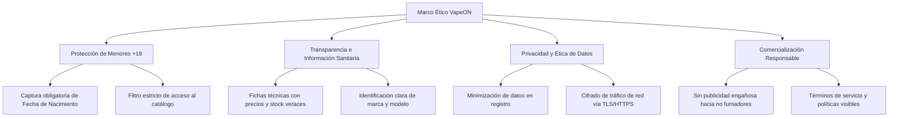
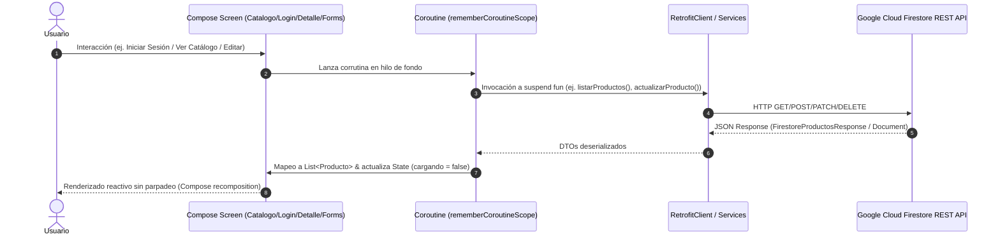

# Documento de Especificación Técnica y Ética - VapeON Móvil (`spec.md`)

| Atributo | Detalle |
| :--- | :--- |
| **Identificador** | `SPEC-VAPEON-001` |
| **Proyecto** | VapeON - Aplicación Móvil Android |
| **Versión** | `1.1.0` |
| **Estado** | `Aprobado` |
| **Fecha de Publicación** | `2026-10-02` |
| **Plataforma Objetivo** | Android (minSdk 31, targetSdk 37, compileSdk 37) |
| **Ubicación del Documento** | `doc/spec.md` (Raíz del Repositorio) |

---

## 1. Resumen Ejecutivo y Alcance

### 1.1 Declaración del Problema
El mercado de dispositivos y accesorios de vapeo requiere plataformas digitales ágiles que permitan a los usuarios mayores de edad consultar catálogos actualizados por marca y stock en tiempo real, garantizando al mismo tiempo un control estricto de acceso, veracidad en las especificaciones del producto y herramientas administrativas para la gestión del inventario.

### 1.2 Objetivos del Sistema
1. Ofrecer un catálogo digital visual e intuitivo organizado por marcas reconocidas (**LifePod**, **Oxbar**, **Nexa**).
2. Facilitar la administración centralizada del inventario (creación, edición, consulta y eliminación de productos) mediante un panel exclusivo para administradores.
3. Asegurar un entorno de navegación seguro y éticamente responsable con control de acceso basado en roles (`ADMIN` y `CLIENTE`).
4. Proveer experiencias visuales fluidas sin parpadeos de carga mediante estados reactivos (`CircularProgressIndicator`) y diseño adaptativo con insets del sistema (`statusBarsPadding`).

### 1.3 Alcance (Scope)
- **En Alcance (In-Scope)**:
  - Registro de usuarios con captura de fecha de nacimiento para verificación de mayoría de edad.
  - Autenticación con verificación de roles en Cloud Firestore (`ADMIN` vs `CLIENTE`).
  - Exploración de catálogo con filtrado por marcas y visualización en tarjetas con scroll horizontal (`LazyRow`).
  - Reutilización de `CatalogoScreen` en `HomeScreen` en modo solo lectura (`esAdmin = false`) para clientes.
  - Ficha técnica a detalle de cada producto en `DetalleProductoScreen` (nombre, marca, precio, stock, descripción, selector de sabores e ícono de favoritos).
  - Formulario de edición `EditarProductoScreen` y creación `AgregarProductoScreen` con subtítulos y resalte corporativo en dorado.
  - Recuperación de contraseña `ForgotPasswordScreen` con interfaz estandarizada.
  - Panel administrativo `AdminHomeScreen` con acciones CRUD completas sobre la colección de productos y carrusel interactivo.
  - Soporte para interfaz oscura nativa (*Dark Mode*) con sistema de diseño Material 3.
- **Fuera de Alcance (Out-of-Scope - Versión 1.1)**:
  - Pasarela de pagos bancarios integrada (se proyecta para versión 2.0).
  - Seguimiento de envíos por GPS en tiempo real.

---

## 2. Especificación Ética y Cumplimiento Normativo (Ethical Specification)

Dado que la aplicación comercializa dispositivos de vapeo y cigarrillos electrónicos, este apartado establece las normas éticas, legales y de protección social que rigen el diseño del software:



### 2.1 Principio de Protección a Menores de Edad (+18)
- **Restricción de Edad Estricta**: La comercialización de productos de vapeo está restringida por ley a mayores de edad (+18 años).
- **Validación en Registro**: En [RegisterScreen.kt](file:///d:/AppMovil_VapeOn/app/src/main/java/com/example/vapeon_movil/RegisterScreen.kt), el campo `fechaNacimiento` es mandatorio y debe ser auditado antes de otorgar credenciales de compra.
- **Tolerancia Cero a Cuentas Menores**: Toda cuenta que no acredite mayoría de edad legal debe ser rechazada o bloqueada de inmediato en base de datos.

### 2.2 Transparencia y Veracidad en el Catálogo
- **Fichas Técnicas Honestas**: Los campos de precio (`precio`), stock disponible (`stock`) y descripción (`descripcion`) deben reflejar con exactitud las características físicas y comerciales del producto.
- **Prevención de Fraude**: Las imágenes y especificaciones de marcas registradas (**LifePod**, **Oxbar**, **Nexa**) no deben inducir a error sobre la capacidad de inhalaciones (puffs), batería o composición de los dispositivos.

### 2.3 Privacidad, Habeas Data y Seguridad de Datos
- **Principio de Minimización**: La aplicación solo recolecta los atributos indispensables para operar: nombre, apellido, teléfono, fecha de nacimiento, correo y contraseña.
- **Seguridad en Tránsito**: Todas las comunicaciones entre el cliente móvil y Google Cloud Firestore se transmiten cifradas sobre el protocolo **HTTPS / TLS 1.3**.
- **No Comercialización de Datos Personales**: Los datos de los usuarios registrados están aislados y no son vendidos ni compartidos con redes publicitarias de terceros.

### 2.4 Matriz de Riesgos Éticos y Salvaguardas Técnicas

| Riesgo Ético / Social | Nivel de Riesgo | Medida de Mitigación Implementada en Software |
| :--- | :--- | :--- |
| Registro de usuarios menores de 18 años | **Crítico** | Validación de fecha de nacimiento en formulario y términos legales obligatorios. |
| Manipulación no autorizada de precios o catálogo | **Alto** | Verificación del rol `ADMIN` en la interfaz antes de habilitar botones de edición o eliminación. |
| Exposición de contraseñas de usuarios | **Alto** | Tráfico protegido con Retrofit HTTPS; se recomienda hash criptográfico (BCrypt/Argon2) en próximas fases. |
| Publicidad abusiva o mensajes invasivos | **Medio** | Ausencia de notificaciones push engañosas o mecánicas de ludificación orientadas al consumo compulsivo. |

---

## 3. Especificación Técnica (Technical Specification)

### 3.1 Arquitectura del Sistema
La aplicación utiliza el patrón **Single-Activity Architecture** completamente declarativo con **Jetpack Compose**, comunicándose directamente con la API REST de Google Cloud Firestore mediante un cliente HTTP estructurado con **Retrofit 2**.



### 3.2 Stack Tecnológico
- **Lenguaje**: Kotlin 2.2.10
- **UI Framework**: Android Jetpack Compose con BOM `2026.02.01`
- **Componentes Material**: `androidx.compose.material3:material3`
- **Gestión Asíncrona**: Kotlin Coroutines & Compose State (`remember`, `mutableStateOf`)
- **Red**: Retrofit `2.9.0` + `converter-gson`
- **Persistencia Cloud**: Cloud Firestore REST API (`projects/dbvapeon/databases/(default)/documents`)

### 3.3 Modelo de Datos de Dominio

#### Entidad `Producto` ([Producto.kt](file:///d:/AppMovil_VapeOn/app/src/main/java/com/example/vapeon_movil/entities/Producto.kt))
```kotlin
data class Producto(
    val id: String = "",          // ID único del documento en Firestore
    val nombre: String,           // Nombre comercial del producto (ej. "Kit LifePod")
    val marca: String,            // Marca asociada (ej. "LifePood", "Oxbar", "Nexa")
    val precio: String,           // Precio de venta en moneda local
    val stock: String,            // Cantidad de existencias disponibles
    val descripcion: String       // Especificaciones técnicas del vape
)
```

#### Entidad `Usuario` ([Usuario.kt](file:///d:/AppMovil_VapeOn/app/src/main/java/com/example/vapeon_movil/entities/Usuario.kt))
```kotlin
data class Usuario(
    val id: String = "",          // Identificador en base de datos
    val nombre: String = "",       // Nombres del usuario
    val apellido: String = "",     // Apellidos del usuario
    val telefono: String = "",     // Número de contacto
    val fechaNacimiento: String = "", // Fecha de nacimiento (control ético +18)
    val correo: String = "",       // Correo electrónico (identificador de login)
    val password: String = "",     // Credencial de acceso
    val rol: String = "CLIENTE"    // Rol asignado: "CLIENTE" o "ADMIN"
)
```

### 3.4 Contratos de API REST (Endpoints)

Base URL: `https://firestore.googleapis.com/v1/projects/dbvapeon/databases/(default)/documents/`

| Servicio | Método | Ruta Relativa | Propósito | Request Body | Response Body |
| :--- | :--- | :--- | :--- | :--- | :--- |
| `ProductoService` | `GET` | `productos` | Listar inventario | Ninguno | `FirestoreProductosResponse` |
| `ProductoService` | `POST` | `productos` | Registrar nuevo vape | `FirestoreProductoContainer` | Objeto Firestore Document |
| `ProductoService` | `PATCH` | `productos/{id}` | Actualizar datos de vape | `FirestoreProductoContainer` | `FirestoreProducto` |
| `ProductoService` | `DELETE`| `productos/{id}` | Dar de baja producto | Ninguno | `Any` (Confirmación) |
| `UsuarioService` | `GET` | `usuarios` | Consultar usuarios | Ninguno | `FirestoreResponse` |
| `UsuarioService` | `GET` | `usuarios/{id}` | Detalle de usuario | Ninguno | `FirestoreDocument` |
| `UsuarioService` | `POST` | `usuarios` | Registrar nuevo usuario | `FirestoreFieldsContainer` | `Any` |
| `UsuarioService` | `PATCH` | `usuarios/{id}` | Actualizar perfil | `FirestoreFieldsContainer` | `FirestoreDocument` |
| `UsuarioService` | `DELETE`| `usuarios/{id}` | Eliminar cuenta | Ninguno | `Any` |

---

## 4. Requerimientos Funcionales y No Funcionales

### 4.1 Requerimientos Funcionales (FR)
- **FR-01 (Autenticación Diferenciada)**: El sistema debe validar correo y contraseña, y dirigir al usuario a la pantalla correspondiente según su rol (`ADMIN` -> `AdminHomeScreen`, `CLIENTE` -> `HomeScreen`).
- **FR-02 (Registro de Clientes)**: Permitir crear cuentas validando campos obligatorios de contacto y fecha de nacimiento.
- **FR-03 (Catálogo Reutilizado en Home)**: `HomeScreen` reutiliza `CatalogoScreen` en modo solo lectura (`esAdmin = false`) para clientes.
- **FR-04 (Ficha de Detalle de Producto)**: `DetalleProductoScreen` muestra la tarjeta de producto, marcas, stock real, precio y selector de sabores. Presenta *"Agregar al carrito"* para `CLIENTE` y *"Editar Producto"* para `ADMIN`.
- **FR-05 (Gestión de Inventario Admin)**: Formularios `AgregarProductoScreen` y `EditarProductoScreen` con subtítulos estilizados en dorado y guardado asíncrono en Firestore.
- **FR-06 (Recuperación de Contraseña)**: `ForgotPasswordScreen` permite solicitar un código de verificación con retorno al login.

### 4.2 Requerimientos No Funcionales (NFR)
- **NFR-01 (Rendimiento y Cargadores Animados)**: Carga reactiva de listas con `CircularProgressIndicator` mientras `cargando == true`, evitando destellos de datos estáticos de muestra.
- **NFR-02 (Ajuste de Insets y Notch)**: Aplicación de `statusBarsPadding()` en las pantallas personalizadas para evitar superposiciones con la barra de estado del sistema.
- **NFR-03 (Tolerancia a Fallos)**: Manejo controlado de excepciones de red con mensajes amigables al usuario ("Error de conexión") evitando cierres forzosos (*ANR* o *Crash*).
- **NFR-04 (Compatibilidad)**: Soporte completo para dispositivos Android desde API 31 (Android 12) hasta API 37.

---

## 5. Criterios de Aceptación y Pruebas (QA / BDD)

### Escenario 1: Inicio de sesión exitoso como Administrador
- **Dado que** un usuario registrado posee el rol `"ADMIN"` en Firestore.
- **Cuando** ingresa su correo y contraseña correctos en [LoginScreen.kt](file:///d:/AppMovil_VapeOn/app/src/main/java/com/example/vapeon_movil/LoginScreen.kt) y pulsa `"INICIAR SESIÓN"`.
- **Entonces** la aplicación lo redirige a la pantalla [AdminHomeScreen.kt](file:///d:/AppMovil_VapeOn/app/src/main/java/com/example/vapeon_movil/AdminHomeScreen.kt) habilitando el menú lateral de gestión.

### Escenario 2: Eliminación ética y segura de producto por administrador
- **Dado que** el administrador se encuentra en el catálogo con `esAdmin = true`.
- **Cuando** pulsa el ícono de eliminar (`Delete`) en una tarjeta de producto [ProductCard.kt](file:///d:/AppMovil_VapeOn/app/src/main/java/com/example/vapeon_movil/components/ProductCard.kt).
- **Entonces** el sistema envía una petición `DELETE` a `productos/{id}` en Firestore y remueve reactivamente el producto de la lista en pantalla.

### Escenario 3: Verificación de edad en registro
- **Dado que** un nuevo usuario accede a [RegisterScreen.kt](file:///d:/AppMovil_VapeOn/app/src/main/java/com/example/vapeon_movil/RegisterScreen.kt).
- **Cuando** completa el formulario indicando su fecha de nacimiento y confirma la creación.
- **Entonces** los datos se guardan en la colección `usuarios` de Firestore asignando por defecto el rol `"CLIENTE"`.

---

## 6. Historial de Cambios y Aprobaciones

| Versión | Fecha | Autor / Equipo | Cambios Realizados |
| :--- | :--- | :--- | :--- |
| `1.0.0` | `2026-09-26` | Equipo de Arquitectura VapeON | Creación inicial de especificación técnica y marco ético del sistema. |
| `1.1.0` | `2026-10-02` | Equipo de Arquitectura VapeON | Actualización general: integración de `DetalleProductoScreen`, `ForgotPasswordScreen`, `AgregarProductoScreen`, `EditarProductoScreen` con subtítulos, `statusBarsPadding()` y eliminador de parpadeos con `CircularProgressIndicator`. |
