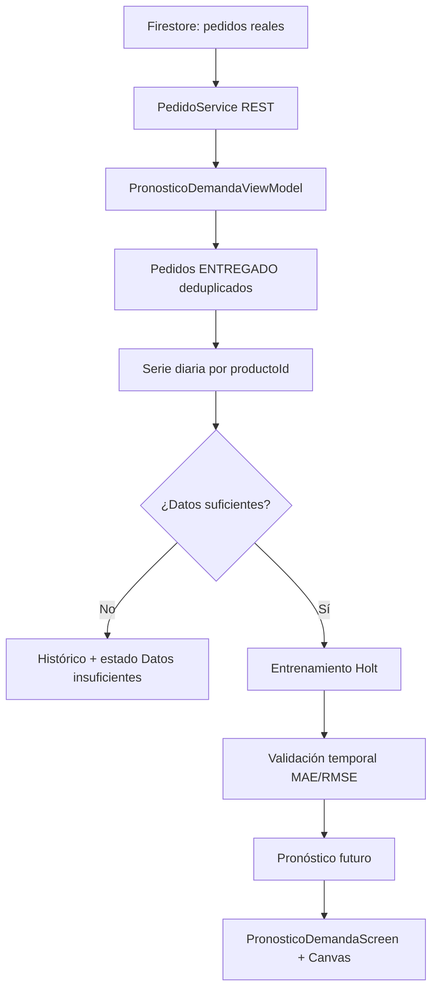

# Documento de Especificación Técnica y Ética - VapeON Móvil (`spec.md`)

| Atributo | Detalle |
| :--- | :--- |
| **Identificador** | `SPEC-VAPEON-001` |
| **Proyecto** | VapeON - Aplicación Móvil Android |
| **Versión** | `1.8.5` |
| **Estado** | `Aprobado` |
| **Fecha de Publicación** | `2026-11-06` |
| **Plataforma Objetivo** | Android (minSdk 31, targetSdk 37, compileSdk 37) |
| **Ubicación del Documento** | `doc/spec.md` (Raíz del Repositorio) |

---

## 1. Resumen Ejecutivo y Alcance

### 1.1 Declaración del Problema
El mercado de dispositivos y accesorios de vapeo requiere plataformas digitales ágiles que permitan a los usuarios mayores de edad consultar catálogos actualizados por marca y stock en tiempo real, garantizando un control estricto de acceso (+18), veracidad en especificaciones de producto y herramientas administrativas para la gestión del inventario.

### 1.2 Alcance del Sistema (Versión 1.8.5)
- **Flujo Guiado de Recuperación de Contraseña (3 Pasos)**:
  - Paso 1: Solicitud de correo con validación de sintaxis y existencia en Firestore REST. Notificación flotante simulada sobre el tope de pantalla con código de 6 dígitos.
  - Paso 2: Verificación de código de 6 casilleros dorados/oscuros (`BasicTextField` con captura directa).
  - Paso 3: Registro de nueva contraseña con toggle de visibilidad e ingreso directo a base de datos.
- **Catálogo de Productos Inteligente (RF12 / RF13 / RNE01)**:
  - Búsqueda reactiva por nombre, marca o descripción (RF12).
  - Categorías superiores: **"Todos"**, **"Nuevos"** (agregados hace máximo 1 semana / 7 días) y **"Promociones"** (`precio <= 60.0`).
  - Botón e ícono flotante de filtros (`Icons.Default.Tune`) ubicado a la izquierda del botón *"Todos"*, con modal para marcas y orden de precio (RF13).
  - Control de visibilidad de stock por rol (**RNE01**): Clientes solo ven productos con `stockTotal > 0`. Administradores ven todos los productos y los agotados muestran la etiqueta roja **"Sin stock"** en la tarjeta.
- **Ficha Técnica, Sabores e Imágenes Dinámicas**:
  - `DetalleProductoScreen` renderiza únicamente los sabores pertenecientes a dicho producto. Si fue creado sin sabor (`tieneSabor == false`), la sección de sabores se oculta.
  - `AgregarSaborScreen` y `EditarSaborScreen` permiten seleccionar una foto de sabor desde la galería o cámara, la cual se comprime y se almacena como data URI base64 en Firestore.
  - Al pulsar cualquier chip de sabor en `DetalleProductoScreen`, la imagen del producto cambia instantáneamente para mostrar la foto correspondiente a dicho sabor.
  - Si un sabor no tiene foto Base64 en Firestore, el resolvedor de imágenes `resolverImagenProducto` identifica el tipo de producto (**Kit Completo** `kitcompleto` vs **Recargas/Cartuchos** `recarga`) y muestra el drawable `muestra_...` nativo correspondiente.
- **Flujo de Checkout y Tarjetas en 4 Pasos**:
  - Registro de tarjetas simulado en 4 pasos (`AgregarTarjetaNumeroScreen`, `AgregarTarjetaExpiracionScreen`, `AgregarTarjetaCvvScreen`, `AgregarTarjetaTitularScreen`).
  - Uso de `VisualTransformation`: `CardNumberVisualTransformation` para agrupar los 16 dígitos en bloques de 4 con espacios sin saltos de cursor, y `ExpirationDateVisualTransformation` para el formato **Año / Mes** (`AA / MM`).
  - Boleta electrónica troquelada (`DatosEntregaScreen`) con número correlativo incremental (`BOLETA ELECTRONICA N° %04d`), bordes troquelados (`arreglo_boleta` / `arreglo_pedido`) y renderizado 100% dinámico de ítems reales del carrito sin datos de prueba.
  - Selección de método de pago (`MetodoPagoScreen`), dirección (`SeleccionDireccionScreen`) y tarjetas guardadas (`SeleccionTarjetaScreen`).
  - **Mapa de ubicación dentro de la app**: al pulsar **"Ver Ubicación"** en una dirección guardada se abre `VerUbicacionScreen` a pantalla completa con el SDK nativo de Google Maps (`maps-compose`), sin salir de la aplicación. La dirección se geocodifica en tiempo de ejecución con `Geocoder` y se marca en el mapa; la tecla Atrás regresa a la lista de direcciones.
  - La API key se lee desde `MAPS_API_KEY` en `local.properties` (no versionado) y se inyecta en el `AndroidManifest` como `com.google.android.geo.API_KEY`. Si no está configurada, la app muestra instrucciones en lugar de un mapa vacío.
- **CRUD de Direcciones del Cliente (colección `direcciones`)**:
  - Acceso desde la opción **"Mis direcciones"** del menú lateral del rol CLIENTE.
  - Alta, listado, edición y eliminación con confirmación; alias obligatorio, dirección obligatoria y sin duplicados por cliente.
  - `SeleccionDireccionScreen` consume las direcciones reales del cliente; la lista fija de ejemplo fue eliminada.
  - Desde el checkout se pueden agregar y editar direcciones, y "Ver Ubicación" sigue disponible para cada una.
  - El alta y la edición incluyen **selección del punto exacto en el mapa**: primero se escribe la dirección, el mapa se centra en el resultado aproximado y el cliente toca el lugar exacto antes de guardar.
  - Al confirmar el punto, la **geocodificación inversa** obtiene el nombre de la calle o lugar y actualiza el campo "Dirección de entrega".
  - `latitud` y `longitud` se guardan en Firestore; `Ver Ubicación` reutiliza esas coordenadas cuando existen.
  - Las rutas `direcciones`, `agregarDireccion` y `editarDireccion` son exclusivas de CLIENTE. Especificación detallada en `doc/specs/direcciones_spec.md`.
  - **Mapa del punto de entrega en el detalle del pedido**: el checkout copia las coordenadas de la dirección elegida al pedido; el detalle muestra un mapa de solo lectura con el marcador exacto y un botón para abrirlo a pantalla completa, tanto para el cliente como para el administrador.
  - Los pedidos históricos sin coordenadas siguen funcionando: el mapa se resuelve geocodificando el texto de `direccionEntrega`.
- **Lista de Pedidos del Administrador con filtros**:
  - Filtros **"Todos"**, **"Registrados"**, **"En camino"** y **"Completados"** aplicados sobre los pedidos reales de Firestore.
  - La vista **"Todos"** oculta los pedidos entregados; estos solo se consultan en **"Completados"**, de modo que el trabajo diario muestre únicamente los pedidos registrados y en camino.
  - Cada tarjeta muestra el número secuencial, la fecha, la cantidad de ítems, el total, el estado real y el acceso **"Ver detalle"**.
  - Los filtros se aplican en memoria sobre la lista ya cargada, sin nuevas consultas ni datos de ejemplo.
- **Detalle del Pedido rediseñado**:
  - Encabezado con marca VAPEON, título "Detalle del Pedido", número secuencial y fecha real.
  - Estado, dirección de entrega, cliente y teléfono tomados del pedido en Firestore.
  - Tarjeta **"Estado del Pedido"** con pasos **R → EC → E** (Registrado, En camino, Entregado); el administrador puede tocar un paso para actualizar el estado real.
  - Listado de productos con marca, cantidad, precio unitario y subtotal reales.
  - Tarjeta **"Resumen de la Compra"** con Sub Total, Delivery, TOTAL A PAGAR, monto pagado, vuelto y método de pago.
  - Se conserva el mapa del punto exacto de entrega con acceso a pantalla completa.
- **Barra de Notificaciones y Menú de Administración**:
  - Configuración global en `Theme.kt` (`window.statusBarColor = VapeOnBackground` con `isAppearanceLightStatusBars = false`) para garantizar la barra de estado negra con íconos blancos y espaciado consistente.
  - Habilitación permanente de la opción **"Marcas"** en el menú de navegación lateral para el rol Administrador hacia `MarcasAdminScreen`.
- **HU-05 — Pronóstico de Demanda**:
  - Acceso exclusivo ADMIN desde `AdminHomeScreen`.
  - Lectura de snapshots reales de la colección `pedidos` mediante Firestore REST, sin crear una colección de pronósticos.
  - Solo los pedidos con `estado = ENTREGADO` forman parte del entrenamiento.
  - Las ventas se agrupan por `productoId` y día local de `America/Lima`; los días intermedios sin ventas se representan con demanda cero.
  - Modelo Holt lineal con `alpha` y `beta` ajustados mediante búsqueda acotada y selección por menor error cuadrático de entrenamiento.
  - Validación cronológica final con MAE y RMSE; nunca se mezcla aleatoriamente el orden temporal.
  - Mínimos centralizados: 14 observaciones diarias, 3 días con demanda y separación viable entre entrenamiento y validación.
  - Cuando no se cumplen los mínimos, la UI muestra el histórico real y `Datos insuficientes`, sin fabricar pronóstico.
  - Gráfica responsive con Canvas que diferencia histórico, validación y horizonte futuro.

---

## 2. Historial de Cambios del Proyecto

| Versión | Fecha | Autor / Equipo | Cambios Realizados |
| :--- | :--- | :--- | :--- |
| `1.0.0` | `2026-09-26` | Equipo VapeON | Creación inicial de especificación técnica y marco ético. |
| `1.1.0` | `2026-10-02` | Equipo VapeON | Integración de `DetalleProductoScreen`, `ForgotPasswordScreen` e indicadores de carga. |
| `1.2.0` | `2026-10-11` | Equipo VapeON | Persistencia local del carrito (`SharedPreferences` + `Gson`) y RBAC de carrito. |
| `1.3.0` | `2026-10-30` | Equipo VapeON | Flujo de recuperación de contraseña de 3 pasos con notificación flotante, filtros flotantes por marca/precio (RF12/RF13), regla de stock por rol (RNE01), conmutador `tieneSabor` e indicadores de carga en `VapeOnGold`. |
| `1.4.0` | `2026-11-04` | Equipo VapeON | CRUD de marcas con siembra inicial y guardas de relaciones; imagen opcional de sabor desde galería/cámara almacenada como data URI base64 en Firestore. |
| `1.5.0` | `2026-11-04` | Equipo VapeON | Flujo de tarjetas en 4 pasos con `VisualTransformation`, boleta troquelada incremental dinámica, resolvedor de imágenes por sabor/tipo (Kit Completo vs Recarga), barra de notificaciones negra global y menú de marcas. |
| `1.6.0` | `2026-11-06` | Equipo VapeON | HU-05 con series reales de pedidos entregados, ajuste Holt, validación temporal MAE/RMSE, gráfica administrativa y estado explícito de datos insuficientes. |
| `1.7.0` | `2026-11-06` | Equipo VapeON | Mapa de Google Maps a pantalla completa en `SeleccionDireccionScreen` ("Ver Ubicación"), con geocodificación de la dirección, marcador y API key leída desde `local.properties`. |
| `1.8.0` | `2026-11-06` | Equipo VapeON | CRUD de direcciones del cliente en Firestore, opción "Mis direcciones" en el menú, validaciones de duplicados y apropiación, y checkout conectado a las direcciones guardadas (se retiró la lista fija). |
| `1.8.1` | `2026-11-06` | Equipo VapeON | Selección del punto exacto de entrega en Google Maps desde los formularios de dirección: geocodificación del texto escrito, marcador ajustable al tocar el mapa y persistencia de `latitud`/`longitud`. |
| `1.8.2` | `2026-11-06` | Equipo VapeON | Geocodificación inversa al seleccionar el punto: el nombre de la calle/lugar detectado actualiza automáticamente el campo "Dirección de entrega" al confirmar el mapa. |
| `1.8.3` | `2026-11-06` | Equipo VapeON | Mapa del punto exacto de entrega en el detalle del pedido: el checkout copia `latitud`/`longitud` al pedido y el administrador ve el marcador en un mapa embebido y a pantalla completa; los pedidos antiguos se geocodifican por texto. |
| `1.8.4` | `2026-11-06` | Equipo VapeON | Lista de pedidos del administrador con filtros por estado ("Todos", "Registrados", "En camino", "Completados"), tarjetas con datos reales de Firestore y vista principal sin pedidos entregados. |
| `1.8.5` | `2026-11-06` | Equipo VapeON | Rediseño del detalle del pedido: encabezado VAPEON, datos reales del pedido, tarjeta de estado con pasos R/EC/E, productos con precio y subtotal, y resumen de compra con total, pago y vuelto. |

---

## 3. Especificación ética y técnica de HU-05

### 3.1 Transparencia y límites

- El módulo se denomina **Pronóstico de demanda — Modelo Holt** y no se presenta como inteligencia artificial generativa.
- No utiliza datos de clientes, direcciones, teléfonos ni información financiera para entrenar.
- No genera observaciones, ventas ni pedidos artificiales.
- La ausencia de historial suficiente se informa explícitamente; no se sustituye por promedios fijos o resultados aleatorios.
- El pronóstico es informativo y no modifica automáticamente inventario, precios ni decisiones de compra.

### 3.2 Flujo técnico

```mermaid
flowchart TD
    A[Firestore: pedidos reales] --> B[PedidoService REST]
    B --> C[PronosticoDemandaViewModel]
    C --> D[Pedidos ENTREGADO deduplicados]
    D --> E[Serie diaria por productoId]
    E --> F{¿Datos suficientes?}
    F -- No --> G[Histórico + estado Datos insuficientes]
    F -- Sí --> H[Entrenamiento Holt]
    H --> I[Validación temporal MAE/RMSE]
    I --> J[Pronóstico futuro]
    J --> K[PronosticoDemandaScreen + Canvas]
```

### 3.3 Criterios de aceptación

- **Dado** un pedido con estado distinto de `ENTREGADO`, **cuando** se construye el dataset, **entonces** sus cantidades no se contabilizan.
- **Dado** un producto con menos de 14 observaciones o menos de 3 días con demanda, **cuando** el administrador lo selecciona, **entonces** no se genera una serie futura.
- **Dado** un historial suficiente, **cuando** se entrena el modelo, **entonces** `alpha` y `beta` proceden del ajuste sobre los datos reales y el tramo final se reserva para MAE/RMSE.
- **Dado** un producto eliminado del catálogo, **cuando** conserva ventas históricas, **entonces** continúa disponible mediante el snapshot del pedido.
- **Dado** un usuario CLIENTE, **cuando** intenta restaurar la ruta de pronóstico, **entonces** la guardia de navegación lo devuelve a su pantalla autorizada.
