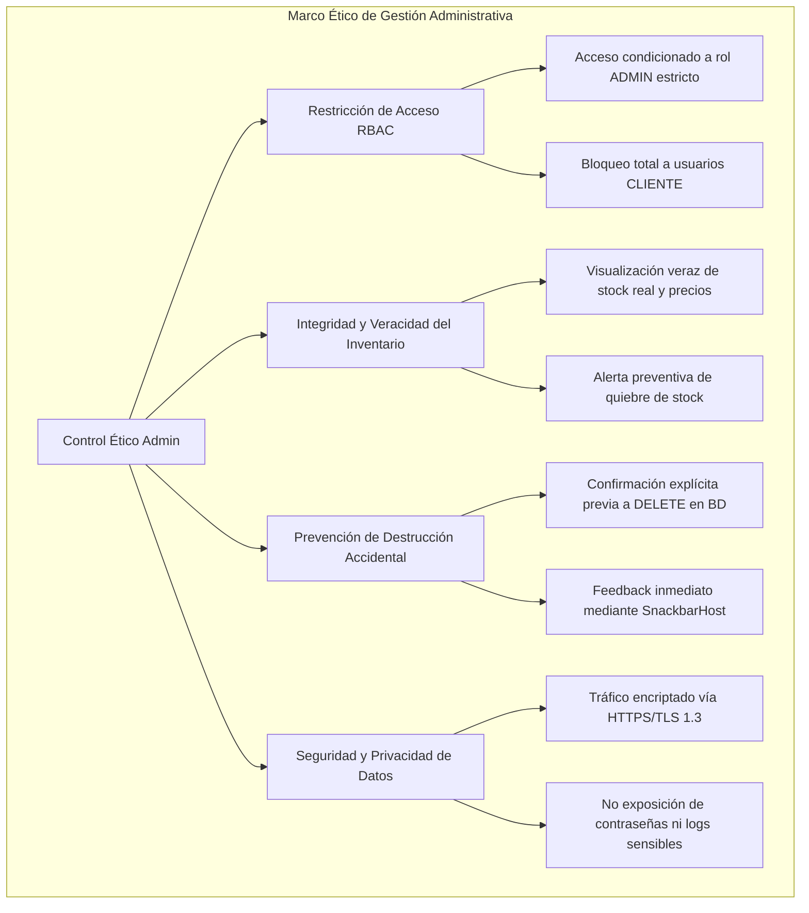
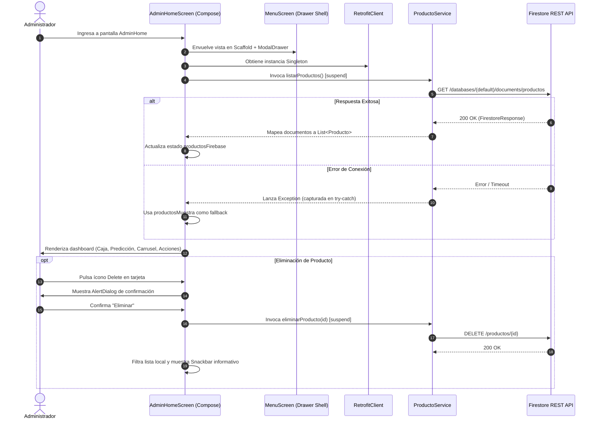

# Especificación Técnica y Ética - Panel Administrativo (`AdminHomeScreen`)

| Metadato | Detalle |
| :--- | :--- |
| **Identificador** | `SPEC-VAPEON-002` |
| **Módulo** | Gestión y Panel de Control de Administración (`AdminHomeScreen`) |
| **Versión** | `1.1.0` |
| **Estado** | `Aprobado` |
| **Fecha de Creación** | `2026-09-27` |
| **Última Actualización** | `2026-09-27` |
| **Autores / Responsables** | Equipo de Arquitectura y Desarrollo VapeON Móvil |
| **Archivo Fuente Principal** | [AdminHomeScreen.kt](file:///d:/AppMovil_VapeOn/app/src/main/java/com/example/vapeon_movil/AdminHomeScreen.kt) |
| **Contenedor / Shell** | [MenuScreen.kt](file:///d:/AppMovil_VapeOn/app/src/main/java/com/example/vapeon_movil/MenuScreen.kt) |

---

## 1. Resumen Ejecutivo y Objetivos del Módulo

### 1.1 Declaración del Problema
El modelo de negocio de VapeON requiere que los administradores de la tienda cuenten con un panel operativo ágil, visualmente atractivo y de fácil acceso táctil para monitorear métricas clave en tiempo real (saldo en caja, proyecciones de rotación de inventario crítico), auditar el catálogo existente y acceder rápidamente a los submódulos de ventas, promociones e inteligencia de negocio, todo desde una interfaz móvil oscura de alto rendimiento.

### 1.2 Objetivos Principales
1. **Centralización Operativa**: Proveer una vista de aterrizaje consolidada exclusiva para usuarios con rol `ADMIN`.
2. **Supervisión de Inventario**: Visualizar productos activos en carrusel horizontal con capacidades de edición directa y eliminación segura asistida por diálogo de confirmación.
3. **Métricas en Tiempo Real**: Presentar indicadores de caja total y predicción predictiva de rotación por sabor/marca (ej. alerta de agotamiento en X días).
4. **Ergonomía y Distribución Visual**: Ofrecer una distribución espacial armónica que extienda el contenido naturalmente hacia la parte inferior de la pantalla sin sobrecargar ni amontonar componentes.

### 1.3 Alcance
- **En Alcance (In-Scope)**:
  - Autenticación previa requerida con rol `ADMIN`.
  - Integración con Firebase Firestore REST API (`ProductoService`) para listar y eliminar productos.
  - Consumo y renderizado de lista de respaldo (*demo products*) en caso de fallas de conectividad o colección vacía.
  - Acciones rápidas mediante grid de 4 botones ergonómicos de 56dp: *Cupones*, *Nueva Venta*, *Estadísticas* e *Inversionistas*.
  - Diálogo modal de confirmación antes de la eliminación física de cualquier registro.
  - Menú lateral deslizable (*Navigation Drawer*) con enlaces a módulos satélite.
- **Fuera de Alcance (Out-of-Scope - Versión Actual)**:
  - Generación de reportes contables descargables en PDF/Excel (proyectado para v2.0).
  - Algoritmo de Machine Learning en dispositivo para la predicción de stock (actualmente alimentado por lógica analítica de backend).

---

## 2. Especificación Ética y Cumplimiento Normativo (Ethical Specification)

Como módulo de control de una plataforma orientada a la comercialización de productos con restricción legal de edad (+18), el panel administrativo opera bajo estrictas directrices éticas:



### 2.1 Principios Éticos y Operativos
1. **Acceso Restringido y No Repudio**:
   - Únicamente las cuentas autenticadas con `rol == "ADMIN"` en Firestore pueden instanciar este Composable.
   - Cualquier intento de acceso con rol `CLIENTE` debe ser denegado y redirigido a [HomeScreen.kt](file:///d:/AppMovil_VapeOn/app/src/main/java/com/example/vapeon_movil/HomeScreen.kt).
2. **Acción Destructiva Segura (Safe-Delete Pattern)**:
   - Toda eliminación de productos requiere interacción explícita en un cuadro de diálogo modal con advertencia de irreversibilidad.
   - Se mitiga la pérdida involuntaria de datos de inventario en entornos táctiles móviles.
3. **Transparencia en Alertas de Consumo y Abastecimiento**:
   - Las métricas de predicción deben advertir con precisión la caducidad y agotamiento de unidades para evitar prácticas comerciales predatorias o ventas de productos sin stock real.

---

## 3. Especificación Técnica y Arquitectura (Technical Specification)

### 3.1 Arquitectura del Módulo y Flujo de Datos



### 3.2 Contratos y Tipos de Datos

#### Entidad de Dominio: `Producto`
Ubicación: [Producto.kt](file:///d:/AppMovil_VapeOn/app/src/main/java/com/example/vapeon_movil/entities/Producto.kt)
```kotlin
data class Producto(
    val id: String = "",
    val nombre: String,
    val marca: String,
    val precio: String,
    val stock: String,
    val descripcion: String
)
```

#### Contratos de Red consumidos (`ProductoService`):
Ubicación: [ProductoService.kt](file:///d:/AppMovil_VapeOn/app/src/main/java/com/example/vapeon_movil/services/ProductoService.kt)
- `GET ("productos")`: Devuelve `FirestoreResponse` que encapsula la lista de documentos Firestore.
- `DELETE ("productos/{id}")`: Ejecuta borrado físico en la base de datos distribuida.

### 3.3 Parámetros y Callbacks del Composable

```kotlin
@Composable
fun AdminHomeScreen(
    irCatalogo: () -> Unit,
    irEditarProducto: (Producto) -> Unit = {},
    onPerfilClick: () -> Unit = {},
    onCajaTotalClick: () -> Unit = {},
    onPrediccionClick: () -> Unit = {},
    onCuponesClick: () -> Unit = {},
    onNuevaVentaClick: () -> Unit = {},
    onEstadisticasClick: () -> Unit = {},
    onInversionistasClick: () -> Unit = {}
)
```

---

## 4. Diseño de Interfaz de Usuario y Experiencia (UI/UX Specification)

### 4.1 Sistema de Espaciado y Distribución Vertical Calibrada

Para resolver la compresión excesiva en pantallas alargadas y asegurar que los componentes alcancen cómodamente hasta antes del final de la pantalla, se aplican los siguientes tokens de espaciado:

| Elemento / Separador | Espaciado / Dimensión | Justificación UX |
| :--- | :--- | :--- |
| **Padding General de Columna** | `horizontal = 20.dp, vertical = 12.dp` | Margen perimetral limpio evitando tocar bordes físicos de pantalla. |
| **Tarjeta Caja Total** | `padding(vertical = 4.dp)` / interior `22.dp` | Tarjeta principal destacada con tipografía de 20sp y 22sp en negrita. |
| **Separador Caja - Predicción** | `Spacer(height = 16.dp)` | Delimita las dos tarjetas métricas sin aglomerarlas. |
| **Tarjeta Predicción** | `padding(vertical = 4.dp)` / interior `20.dp` | Alerta de rotación de producto crítico con énfasis en marca y sabor. |
| **Separador Predicción - Productos** | `Spacer(height = 28.dp)` | Transición clara entre métricas financieras y gestión de inventario. |
| **Encabezado de Productos** | `padding(bottom = 14.dp)` | Título en `VapeOnGold` con acceso rápido "Ver todos" (`15.sp`). |
| **Tarjetas del Carrusel (`LazyRow`)** | `width(170.dp)`, contenedor imagen `height(120.dp)` | Proporción espaciosa con íconos táctiles de Editar y Eliminar de 32dp. |
| **Separador Productos - Acciones** | `Spacer(height = 30.dp)` | División visual amplia hacia la botonera de acciones rápidas. |
| **Botones de Más Acciones** | `height(56.dp)`, íconos de 20dp, texto 11.5 - 12sp | Cumplimiento del estándar Material Design de área táctil mínima (48-56dp). |
| **Separador entre Filas de Botones** | `Spacer(height = 16.dp)`, `spacedBy(14.dp)` | Evita pulsaciones erróneas entre botones adyacentes. |
| **Separador Inferior Final** | `Spacer(height = 36.dp)` | Permite que el contenido se extienda hasta justo antes del final de la pantalla. |

### 4.2 Paleta Cromática Oficial Aplicada
- Fondo general: `VapeOnBackground` (`#0D0E15`)
- Fondo de tarjetas de producto: `VapeOnCardBackground` (`#1F222E`)
- Fondo de contenedor de imagen: `VapeOnProductImageBg` (`#2A2E3D`)
- Botones de acción y tarjetas de métricas: `VapeOnRed` (`#ED2025`)
- Acentos tipográficos y encabezados: `VapeOnGold` (`#EAA016`)
- Texto primario: `VapeOnTextPrimary` (`#FFFFFF`)

---

## 5. Criterios de Aceptación y Pruebas (QA / BDD Spec)

### Escenario 1: Distribución espacial correcta en pantalla
- **Dado que** el usuario administrador ha iniciado sesión y se encuentra en `AdminHomeScreen`.
- **Cuando** la pantalla se renderiza en un dispositivo con resolución estándar o extendida.
- **Entonces** las tarjetas de métricas, el carrusel de productos y las dos filas de botones de acción se distribuyen de manera holgada sin verse apretados, alcanzando el final de la botonera un poco antes del borde inferior de la pantalla con un margen final de `36.dp`.

### Escenario 2: Confirmación y eliminación reactiva de producto
- **Dado que** se muestran productos en el carrusel horizontal.
- **Cuando** el administrador pulsa el botón de eliminar (`Delete`) de una tarjeta específica.
- **Entonces** se despliega un `AlertDialog` solicitando confirmación con botones "Eliminar" y "Cancelar".
- **Y si** pulsa "Eliminar", se ejecuta la llamada `DELETE` en Firestore, se remueve el producto del estado local inmediatamente y se notifica al usuario mediante un Snackbar.

### Escenario 3: Navegación hacia edición de producto
- **Dado que** el administrador visualiza un producto en el carrusel.
- **Cuando** pulsa el ícono de edición (`Edit`).
- **Entonces** el sistema invoca el callback `irEditarProducto(prod)` redirigiendo a [EditarProductoScreen.kt](file:///d:/AppMovil_VapeOn/app/src/main/java/com/example/vapeon_movil/EditarProductoScreen.kt) con los datos del producto precargados.

---

## 6. Historial de Versiones del Documento

| Versión | Fecha | Autor / Equipo | Descripción de Cambios |
| :--- | :--- | :--- | :--- |
| `1.0.0` | `2026-09-26` | Equipo de Arquitectura VapeON | Especificación inicial general en `doc/spec.md`. |
| `1.1.0` | `2026-09-27` | Equipo de Arquitectura VapeON | Creación de especificación técnica y ética dedicada para `AdminHomeScreen.kt` ([SPEC-VAPEON-002](file:///d:/AppMovil_VapeOn/doc/specs/admin_home_spec.md)), formalizando la calibración de espaciados, alturas ergonómicas de botones (56dp) y flujo reactivo de eliminación. |
