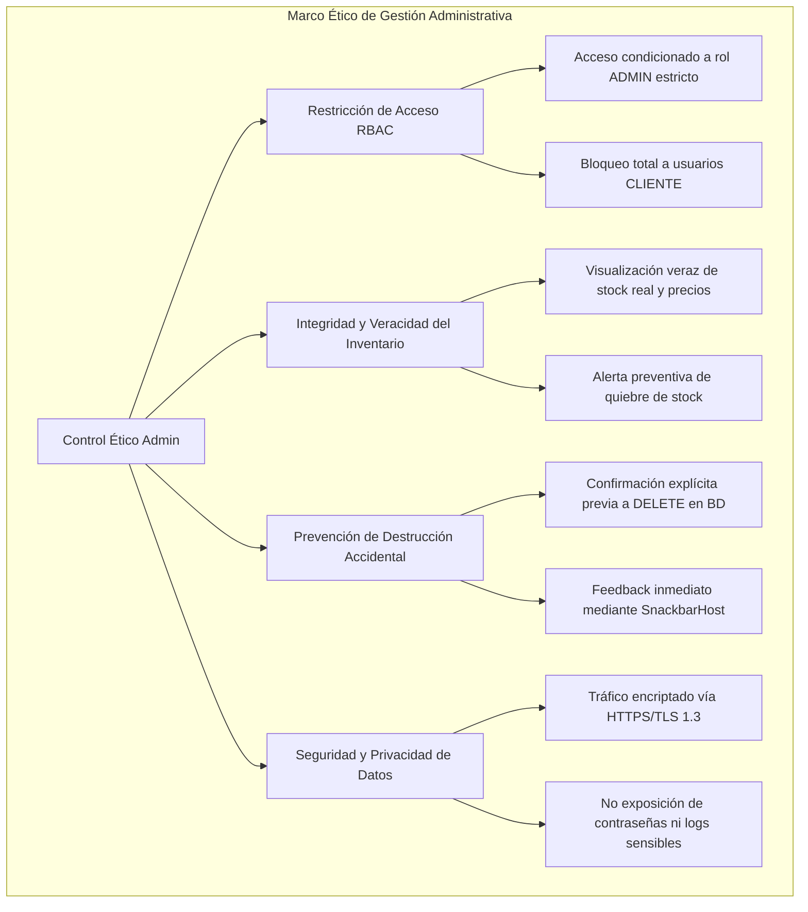
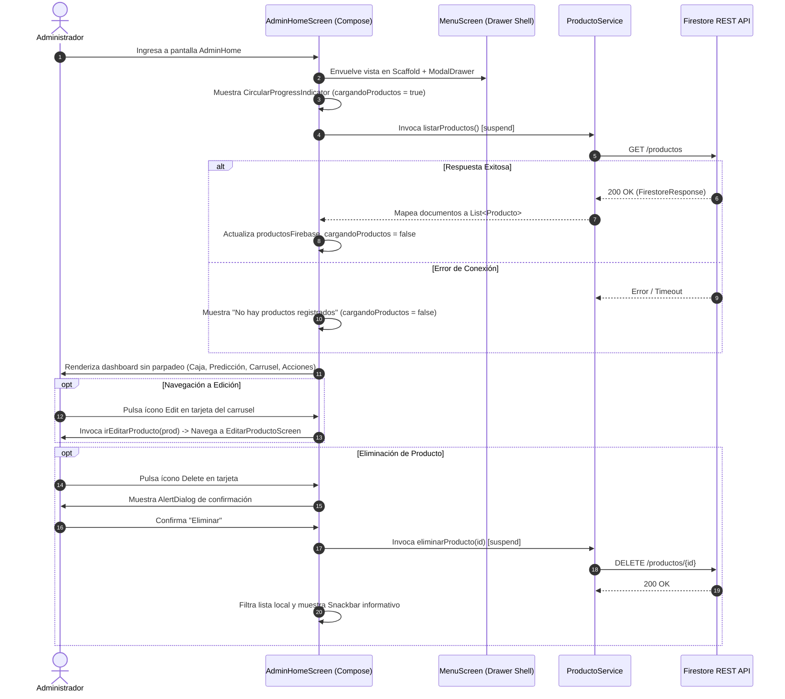

# Especificación Técnica y Ética - Panel Administrativo (`AdminHomeScreen`)

| Metadato | Detalle |
| :--- | :--- |
| **Identificador** | `SPEC-VAPEON-002` |
| **Módulo** | Gestión y Panel de Control de Administración (`AdminHomeScreen`) |
| **Versión** | `1.2.0` |
| **Estado** | `Aprobado` |
| **Fecha de Creación** | `2026-09-27` |
| **Última Actualización** | `2026-10-02` |
| **Autores / Responsables** | Equipo de Arquitectura y Desarrollo VapeON Móvil |
| **Archivo Fuente Principal** | [AdminHomeScreen.kt](file:///d:/AppMovil_VapeOn/app/src/main/java/com/example/vapeon_movil/ui/AdminHomeScreen.kt) |
| **Contenedor / Shell** | [MenuScreen.kt](file:///d:/AppMovil_VapeOn/app/src/main/java/com/example/vapeon_movil/ui/MenuScreen.kt) |

---

## 1. Resumen Ejecutivo y Objetivos del Módulo

### 1.1 Declaración del Problema
El modelo de negocio de VapeON requiere que los administradores de la tienda cuenten con un panel operativo ágil, visualmente atractivo y de fácil acceso táctil para monitorear métricas clave en tiempo real (saldo en caja, proyecciones de rotación de inventario crítico), auditar el catálogo existente y acceder rápidamente a los submódulos de ventas, promociones e inteligencia de negocio, todo desde una interfaz móvil oscura de alto rendimiento.

### 1.2 Objetivos Principales
1. **Centralización Operativa**: Proveer una vista de aterrizaje consolidada exclusiva para usuarios con rol `ADMIN`.
2. **Supervisión e Integración de Inventario**: Visualizar productos activos en carrusel horizontal con capacidades de edición directa (redirección a `EditarProductoScreen`) y eliminación segura asistida por diálogo de confirmación.
3. **Carga Fluida de Carrusel**: Presentación de un spinner animado (`CircularProgressIndicator`) mientras `cargandoProductos == true`, eliminando el parpadeo de datos estáticos de demostración.
4. **Métricas en Tiempo Real**: Presentar indicadores de caja total y predicción predictiva de rotación por sabor/marca.
5. **Ergonomía y Distribución Visual**: Ofrecer una distribución espacial armónica que extienda el contenido naturalmente hacia la parte inferior de la pantalla sin sobrecargar ni amontonar componentes.

### 1.3 Alcance
- **En Alcance (In-Scope)**:
  - Autenticación previa requerida con rol `ADMIN`.
  - Integración con Firebase Firestore REST API (`ProductoService`) para listar y eliminar productos.
  - Indicador animado de carga `CircularProgressIndicator` en la sección de carrusel mientras se cargan los productos desde la red.
  - Navegación hacia `EditarProductoScreen` desde el botón del lápiz en cada tarjeta del carrusel.
  - Acciones rápidas mediante grid de 4 botones ergonómicos de 56dp: *Cupones*, *Nueva Venta*, *Estadísticas* e *Inversionistas*.
  - Diálogo modal de confirmación antes de la eliminación física de cualquier registro.
  - Menú lateral deslizable (*Navigation Drawer*) con enlaces a módulos satélite.
- **Fuera de Alcance (Out-of-Scope - Versión Actual)**:
  - Generación de reportes contables descargables en PDF/Excel (proyectado para v2.0).

---

## 2. Especificación Ética y Cumplimiento Normativo (Ethical Specification)



### 2.1 Principios Éticos y Operativos
1. **Acceso Restringido y No Repudio**:
   - Únicamente las cuentas autenticadas con `rol == "ADMIN"` en Firestore pueden instanciar este Composable.
2. **Acción Destructiva Segura (Safe-Delete Pattern)**:
   - Toda eliminación de productos requiere interacción explícita en un cuadro de diálogo modal con advertencia de irreversibilidad.

---

## 3. Especificación Técnica y Arquitectura (Technical Specification)

### 3.1 Arquitectura del Módulo y Flujo de Datos



### 3.2 Parámetros del Composable

```kotlin
@Composable
fun AdminHomeScreen(
    irCatalogo: () -> Unit,
    irEditarProducto: (Producto) -> Unit = {}, // Conectado en VapeONApp hacia EditarProductoScreen
    onPerfilClick: () -> Unit = {},
    onCajaTotalClick: () -> Unit = {},
    onPrediccionClick: () -> Unit = {},
    onCuponesClick: () -> Unit = {},
    onNuevaVentaClick: () -> Unit = {},
    onEstadisticasClick: () -> Unit = {},
    onInversionistasClick: () -> Unit = {}
)
```

---

## 4. Criterios de Aceptación y Pruebas (QA / BDD Spec)

### Escenario 1: Carga de carrusel de productos sin parpadeos
- **Dado que** el usuario administrador ingresa a `AdminHomeScreen`.
- **Cuando** `cargandoProductos == true` durante la petición HTTP a Firestore REST.
- **Entonces** el carrusel de productos muestra el indicador `CircularProgressIndicator` centrado sin destellos de datos estáticos de muestra.

### Escenario 2: Navegación desde tarjeta a EditarProductoScreen
- **Dado que** se cargaron los productos reales en el carrusel.
- **Cuando** el administrador pulsa el ícono de edición (`Edit`) en una tarjeta de producto.
- **Entonces** el sistema invoca `irEditarProducto(prod)`, asigna `productoEditar` en `VapeONApp` y abre la pantalla `EditarProductoScreen`.

---

## 5. Historial de Versiones del Documento

| Versión | Fecha | Autor / Equipo | Descripción de Cambios |
| :--- | :--- | :--- | :--- |
| `1.0.0` | `2026-09-26` | Equipo de Arquitectura VapeON | Especificación inicial general en `doc/spec.md`. |
| `1.1.0` | `2026-09-27` | Equipo de Arquitectura VapeON | Creación de especificación técnica y ética dedicada para `AdminHomeScreen.kt`. |
| `1.2.0` | `2026-10-02` | Equipo de Arquitectura VapeON | Conexión de la navegación `irEditarProducto` hacia `EditarProductoScreen`, eliminación de productos estáticos de demostración y adición de `CircularProgressIndicator`. |
