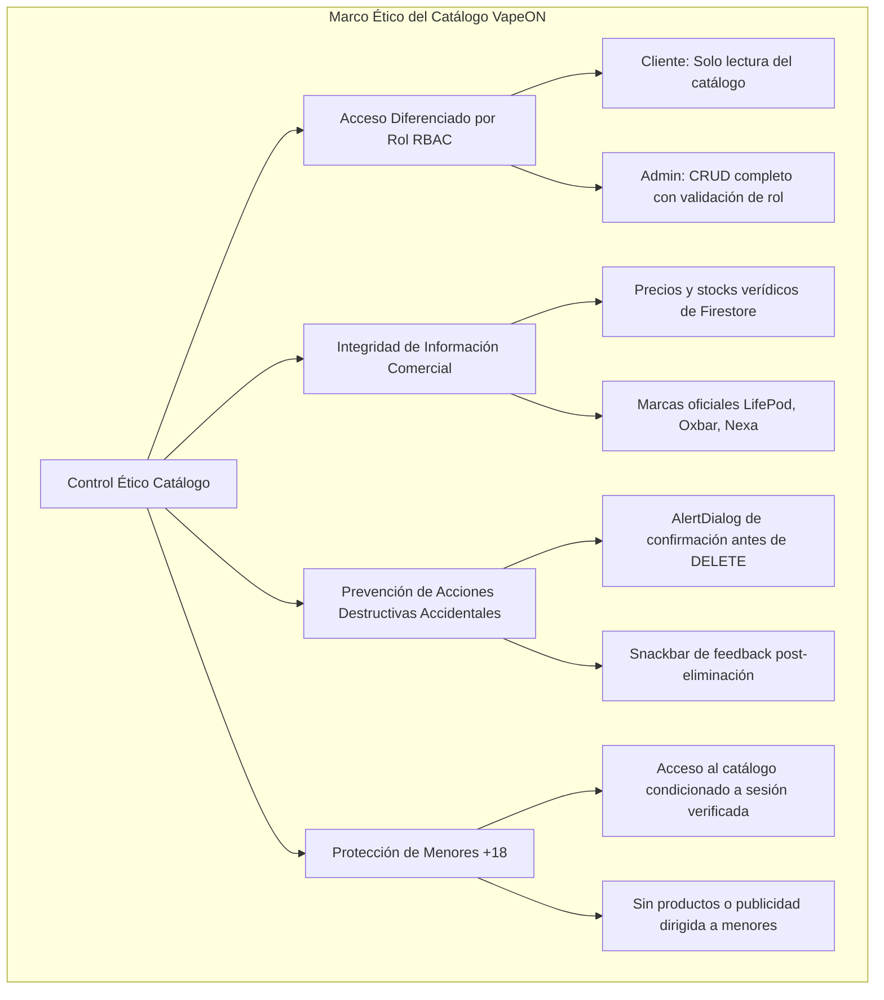
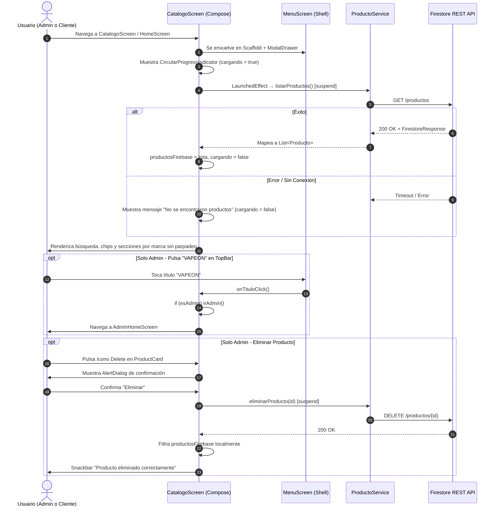

# Especificación Técnica y Ética - Catálogo de Productos (`CatalogoScreen`)

| Metadato | Detalle |
| :--- | :--- |
| **Identificador** | `SPEC-VAPEON-003` |
| **Módulo** | Catálogo de Productos con Gestión de Inventario Diferenciada por Rol |
| **Versión** | `1.1.0` |
| **Estado** | `Aprobado` |
| **Fecha de Creación** | `2026-09-27` |
| **Última Actualización** | `2026-10-02` |
| **Autores / Responsables** | Equipo de Arquitectura y Desarrollo VapeON Móvil |
| **Archivos Fuente** | [CatalogoScreen.kt](file:///d:/AppMovil_VapeOn/app/src/main/java/com/example/vapeon_movil/ui/CatalogoScreen.kt) · [MarcaSection.kt](file:///d:/AppMovil_VapeOn/app/src/main/java/com/example/vapeon_movil/components/MarcaSection.kt) · [ProductCard.kt](file:///d:/AppMovil_VapeOn/app/src/main/java/com/example/vapeon_movil/components/ProductCard.kt) |
| **Contenedor / Shell** | [MenuScreen.kt](file:///d:/AppMovil_VapeOn/app/src/main/java/com/example/vapeon_movil/ui/MenuScreen.kt) |

---

## 1. Resumen Ejecutivo y Objetivos del Módulo

### 1.1 Declaración del Problema
El catálogo de VapeON debe servir dos perfiles de usuario con necesidades radicalmente distintas en la misma pantalla:

- **Cliente**: Navegación visual del inventario organizado por marcas, con búsqueda y filtrado, en modo solo lectura (reutilizado desde `HomeScreen`).
- **Administrador**: Las mismas capacidades del cliente, más controles directos de edición y eliminación de productos, botón flotante de alta y navegación rápida de regreso al panel de administración.

### 1.2 Objetivos Principales
1. **Catálogo Unificado con Vista Diferenciada**: Una única pantalla con comportamiento adaptado al rol del usuario sin duplicar código.
2. **Búsqueda y Filtrado Reactivo**: Búsqueda en tiempo real por nombre, marca y descripción, combinada con filtros de categoría por chips.
3. **Carga Fluida sin Destellos**: Presentación de un spinner animado (`CircularProgressIndicator`) mientras `cargando == true`, evitando el destello inicial de items estáticos de muestra.
4. **Gestión Segura de Inventario (Admin)**: Edición y eliminación de productos con confirmación explícita mediante diálogo modal.
5. **Navegación Contextual por Rol**: Acceso rápido al panel administrativo desde la barra superior solo para usuarios con rol `ADMIN`.

### 1.3 Alcance
- **En Alcance (In-Scope)**:
  - Carga y renderizado de productos desde Firestore REST API agrupados por marca.
  - Estado de carga limpio con `CircularProgressIndicator` en dorado `VapeOnGold`.
  - Reutilización directa por `HomeScreen` para el rol `CLIENTE`.
  - Búsqueda en tiempo real filtrada por nombre, marca y descripción.
  - Chips de categoría: **Todos**, **Nuevos**, **Promociones** (precio < S/. 75).
  - Secciones separadas por marca: **LifePod**, **Oxbar**, **Nexa** y marcas dinámicas adicionales.
  - Controles de **Editar** (ícono lápiz) y **Eliminar** (ícono papelera) con confirmación — exclusivos para `ADMIN`.
  - Botón flotante rojo (`+`) para agregar nuevos productos — exclusivo para `ADMIN`.
  - Título "VAPEON" clickeable que redirige al `AdminHomeScreen` — solo si `esAdmin == true`.
- **Fuera de Alcance (Out-of-Scope)**:
  - Carrito de compras y procesamiento de pagos (v2.0).
  - Filtros avanzados por precio, stock o especificaciones técnicas (v2.0).

---

## 2. Especificación Ética y Cumplimiento Normativo (Ethical Specification)



### 2.1 Principios Éticos Aplicados
1. **Control de Acceso por Rol (RBAC)**:
   - El parámetro `esAdmin: Boolean` controla la visibilidad de controles de gestión. No se exponen botones de edición o eliminación a usuarios con rol `CLIENTE`.
   - La navegación al panel administrativo (`AdminHomeScreen`) desde el título "VAPEON" está condicionada a `if (esAdmin)`.
2. **Acción Destructiva Segura (Safe-Delete Pattern)**:
   - Toda eliminación de un producto de Firestore requiere confirmación explícita en un `AlertDialog` con descripción de la acción y advertencia de irreversibilidad.
3. **Transparencia Comercial**:
   - Los precios (`precio`) y unidades disponibles (`stock`) se obtienen directamente de Firestore en tiempo real, garantizando información veraz al cliente.

---

## 3. Especificación Técnica y Arquitectura (Technical Specification)

### 3.1 Flujo de Datos y Ciclo de Vida



### 3.2 Parámetros del Composable `CatalogoScreen`

```kotlin
@Composable
fun CatalogoScreen(
    irDetalleProducto: (Producto) -> Unit,  // Navega al detalle de un producto
    esAdmin: Boolean = false,               // Controla visibilidad de controles Admin
    irAgregarProducto: () -> Unit = {},     // Navega a AgregarProductoScreen (Admin)
    irEditarProducto: (Producto) -> Unit = {}, // Navega a EditarProductoScreen (Admin)
    onPerfilClick: () -> Unit = {},         // Abre el perfil del usuario
    irAdmin: () -> Unit = {}               // Regresa a AdminHomeScreen (solo si esAdmin)
)
```

### 3.3 Contratos de API Consumidos
Ubicación: [ProductoService.kt](file:///d:/AppMovil_VapeOn/app/src/main/java/com/example/vapeon_movil/services/ProductoService.kt)

| Método | Endpoint Firestore | Uso en CatalogoScreen |
| :--- | :--- | :--- |
| `GET` | `productos` | `LaunchedEffect` → carga inicial del catálogo |
| `DELETE` | `productos/{id}` | Eliminación segura con confirmación (solo Admin) |

### 3.4 Estado Reactivo del Composable

| Variable de Estado | Tipo | Propósito |
| :--- | :--- | :--- |
| `busqueda` | `String` | Término de búsqueda en tiempo real |
| `categoriaSeleccionada` | `String` | Chip activo: `"Todos"` / `"Nuevos"` / `"Promociones"` |
| `productosFirebase` | `List<Producto>` | Lista cargada desde Firestore |
| `cargando` | `Boolean` | Estado de carga inicial (controla `CircularProgressIndicator`) |
| `productoAEliminar` | `Producto?` | Producto pendiente de confirmación para eliminar |

---

## 4. Criterios de Aceptación y Pruebas (QA / BDD Spec)

### Escenario 1: Cliente visualiza catálogo en modo solo lectura
- **Dado que** un usuario con rol `CLIENTE` ha iniciado sesión y se encuentra en `CatalogoScreen`.
- **Cuando** la pantalla carga y se muestran las tarjetas de productos.
- **Entonces** las tarjetas se muestran sin íconos de editar ni eliminar, y el botón flotante `+` no es visible.

### Escenario 2: Estado de carga sin parpadeos de muestra
- **Dado que** el usuario ingresa al catálogo.
- **Cuando** `cargando == true` durante la petición HTTP a Firestore.
- **Entonces** la interfaz muestra el spinner `CircularProgressIndicator` en color dorado sin destellos de datos estáticos de prueba.

---

## 5. Historial de Versiones del Documento

| Versión | Fecha | Autor / Equipo | Descripción de Cambios |
| :--- | :--- | :--- | :--- |
| `1.0.0` | `2026-09-27` | Equipo de Arquitectura VapeON | Creación inicial de especificación técnica y ética para `CatalogoScreen.kt`. |
| `1.1.0` | `2026-10-02` | Equipo de Arquitectura VapeON | Eliminación de productos estáticos de muestra (`productosMuestra`), integración del cargador `CircularProgressIndicator` y reutilización de `CatalogoScreen` en `HomeScreen` para el rol `CLIENTE`. |
