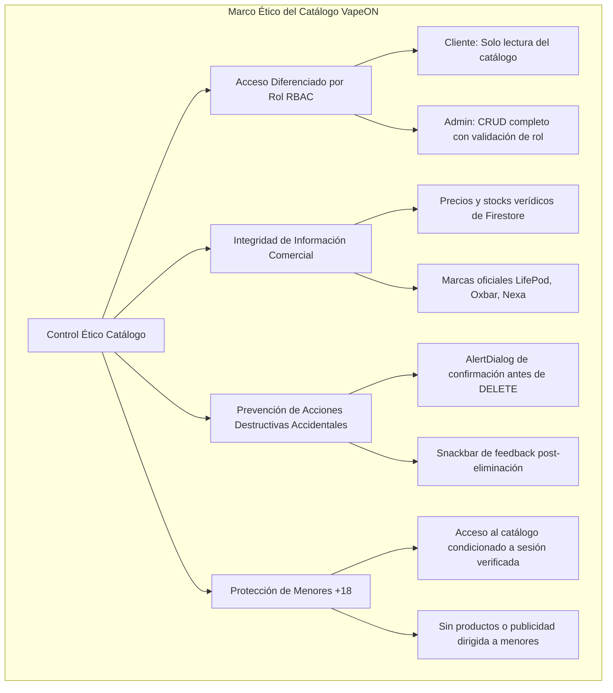
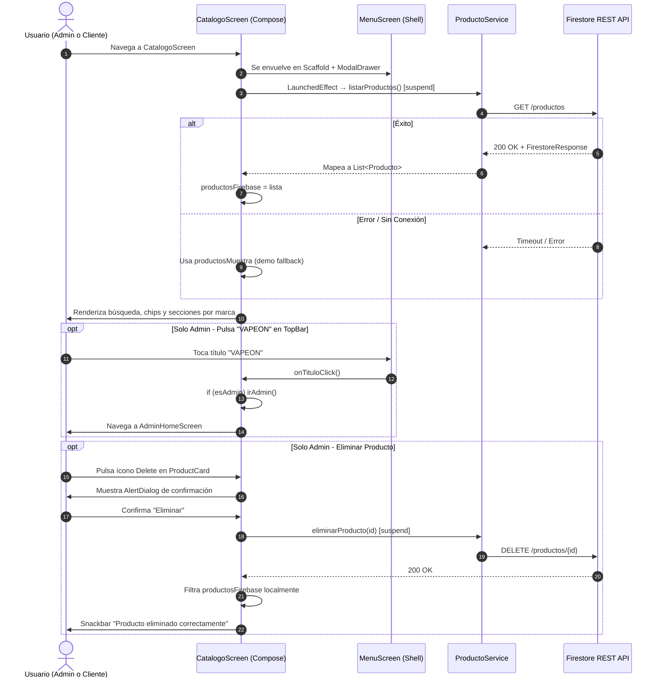
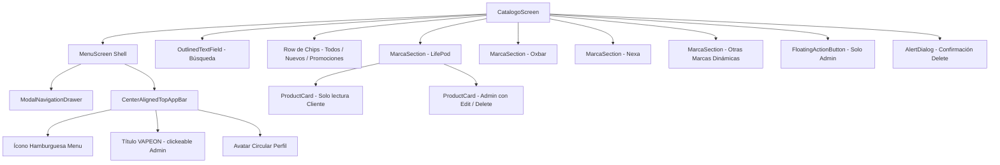

# Especificación Técnica y Ética - Catálogo de Productos (`CatalogoScreen`)

| Metadato | Detalle |
| :--- | :--- |
| **Identificador** | `SPEC-VAPEON-003` |
| **Módulo** | Catálogo de Productos con Gestión de Inventario Diferenciada por Rol |
| **Versión** | `1.0.0` |
| **Estado** | `Aprobado` |
| **Fecha de Creación** | `2026-09-27` |
| **Última Actualización** | `2026-09-27` |
| **Autores / Responsables** | Equipo de Arquitectura y Desarrollo VapeON Móvil |
| **Archivos Fuente** | [CatalogoScreen.kt](file:///d:/AppMovil_VapeOn/app/src/main/java/com/example/vapeon_movil/CatalogoScreen.kt) · [MarcaSection.kt](file:///d:/AppMovil_VapeOn/app/src/main/java/com/example/vapeon_movil/components/MarcaSection.kt) · [ProductCard.kt](file:///d:/AppMovil_VapeOn/app/src/main/java/com/example/vapeon_movil/components/ProductCard.kt) |
| **Contenedor / Shell** | [MenuScreen.kt](file:///d:/AppMovil_VapeOn/app/src/main/java/com/example/vapeon_movil/MenuScreen.kt) |

---

## 1. Resumen Ejecutivo y Objetivos del Módulo

### 1.1 Declaración del Problema
El catálogo de VapeON debe servir dos perfiles de usuario con necesidades radicalmente distintas en la misma pantalla:

- **Cliente**: Navegación visual del inventario organizado por marcas, con búsqueda y filtrado, en modo solo lectura.
- **Administrador**: Las mismas capacidades del cliente, más controles directos de edición y eliminación de productos, botón flotante de alta y navegación rápida de regreso al panel de administración.

### 1.2 Objetivos Principales
1. **Catálogo Unificado con Vista Diferenciada**: Una única pantalla con comportamiento adaptado al rol del usuario sin duplicar código.
2. **Búsqueda y Filtrado Reactivo**: Búsqueda en tiempo real por nombre, marca y descripción, combinada con filtros de categoría por chips.
3. **Gestión Segura de Inventario (Admin)**: Edición y eliminación de productos con confirmación explícita mediante diálogo modal.
4. **Navegación Contextual por Rol**: Acceso rápido al panel administrativo desde la barra superior solo para usuarios con rol `ADMIN`.
5. **Resiliencia Offline**: Muestra de productos de respaldo (*demo products*) cuando Firestore no está disponible.

### 1.3 Alcance
- **En Alcance (In-Scope)**:
  - Carga y renderizado de productos desde Firestore REST API agrupados por marca.
  - Búsqueda en tiempo real filtrada por nombre, marca y descripción.
  - Chips de categoría: **Todos**, **Nuevos**, **Promociones** (precio < S/. 75).
  - Secciones separadas por marca: **LifePod**, **Oxbar**, **Nexa** y marcas dinámicas adicionales.
  - Controles de **Editar** (ícono lápiz) y **Eliminar** (ícono papelera) con confirmación — exclusivos para `ADMIN`.
  - Botón flotante rojo (`+`) para agregar nuevos productos — exclusivo para `ADMIN`.
  - Título "VAPEON" clickeable que redirige al `AdminHomeScreen` — solo si `esAdmin == true`.
  - Productos de respaldo visual en caso de colección vacía o error de conectividad.
- **Fuera de Alcance (Out-of-Scope)**:
  - Carrito de compras y procesamiento de pagos (v2.0).
  - Filtros avanzados por precio, stock o especificaciones técnicas (v2.0).

---

## 2. Especificación Ética y Cumplimiento Normativo (Ethical Specification)



### 2.1 Principios Éticos Aplicados
1. **Control de Acceso por Rol (RBAC)**:
   - El parámetro `esAdmin: Boolean` controla la visibilidad de controles de gestión. No se exponen botones de edición o eliminación a usuarios con rol `CLIENTE`.
   - La navegación al panel administrativo (`AdminHomeScreen`) desde el título "VAPEON" está condicionada a `if (esAdmin)`.
2. **Acción Destructiva Segura (Safe-Delete Pattern)**:
   - Toda eliminación de un producto de Firestore requiere confirmación explícita en un `AlertDialog` con descripción de la acción y advertencia de irreversibilidad.
3. **Transparencia Comercial**:
   - Los precios (`precio`) y unidades disponibles (`stock`) se obtienen directamente de Firestore en tiempo real, garantizando información veraz al cliente.
4. **Resiliencia sin Datos Falsos**:
   - Los productos de respaldo (*demo*) son únicamente para uso visual en desarrollo y flujos de error; en producción la interfaz espera datos reales de Firestore.

---

## 3. Especificación Técnica y Arquitectura (Technical Specification)

### 3.1 Flujo de Datos y Ciclo de Vida



### 3.2 Parámetros del Composable `CatalogoScreen`

```kotlin
@Composable
fun CatalogoScreen(
    irDetalleProducto: (Producto) -> Unit,  // Navega al detalle de un producto
    esAdmin: Boolean = false,               // Controla visibilidad de controles Admin
    irAgregarProducto: () -> Unit = {},     // Navega a AgregarProductoScreen (Admin)
    irEditarProducto: (Producto) -> Unit = {}, // Navega a EditarProductoScreen (Admin)
    onPerfilClick: () -> Unit = {},         // Abre el perfil del administrador
    irAdmin: () -> Unit = {}               // Regresa a AdminHomeScreen (solo si esAdmin)
)
```

### 3.3 Contratos de API Consumidos
Ubicación: [ProductoService.kt](file:///d:/AppMovil_VapeOn/app/src/main/java/com/example/vapeon_movil/services/ProductoService.kt)

| Método | Endpoint Firestore | Uso en CatalogoScreen |
| :--- | :--- | :--- |
| `GET` | `productos` | `LaunchedEffect` → carga inicial del catálogo |
| `DELETE` | `productos/{id}` | Eliminación segura con confirmación (solo Admin) |

### 3.4 Estado Reactivo del Composable

| Variable de Estado | Tipo | Propósito |
| :--- | :--- | :--- |
| `busqueda` | `String` | Término de búsqueda en tiempo real |
| `categoriaSeleccionada` | `String` | Chip activo: `"Todos"` / `"Nuevos"` / `"Promociones"` |
| `productosFirebase` | `List<Producto>` | Lista cargada desde Firestore |
| `cargando` | `Boolean` | Estado de carga inicial |
| `productoAEliminar` | `Producto?` | Producto pendiente de confirmación para eliminar |

### 3.5 Lógica de Filtrado Reactivo

```kotlin
val listaFiltrada = listaBase.filter { prod ->
    // Coincidencia por texto (nombre, marca, descripción)
    val coincideTexto = busqueda.isBlank() ||
        prod.nombre.contains(busqueda, ignoreCase = true) ||
        prod.marca.contains(busqueda, ignoreCase = true) ||
        prod.descripcion.contains(busqueda, ignoreCase = true)

    // Coincidencia por categoría seleccionada
    val coincideCategoria = when (categoriaSeleccionada) {
        "Nuevos"      -> prod.id.contains("demo") || prod.id.length > 5
        "Promociones" -> prod.precio.toDoubleOrNull()?.let { it < 75 } ?: false
        else          -> true
    }

    coincideTexto && coincideCategoria
}
```

---

## 4. Diseño de Interfaz de Usuario y Experiencia (UI/UX Specification)

### 4.1 Mapa de Componentes



### 4.2 Especificación de Componentes Clave

#### `ProductCard` — Tarjeta de Producto
Ubicación: [ProductCard.kt](file:///d:/AppMovil_VapeOn/app/src/main/java/com/example/vapeon_movil/components/ProductCard.kt)

| Elemento | Especificación |
| :--- | :--- |
| **Ancho** | `170.dp` |
| **Fondo** | `VapeOnCardBackground` (`#3F321B` — bronce dorado oscuro) |
| **Bordes** | `RoundedCornerShape(26.dp)` |
| **Contenedor de imagen** | Recuadro blanco `VapeOnProductImageBg`, `120.dp` de alto, `RoundedCornerShape(20.dp)` |
| **Nombre** | `VapeOnTextPrimary`, `15.sp`, `FontWeight.Bold`, máx. 1 línea con ellipsis |
| **Precio** | Formato `"S/. X"`, `VapeOnTextPrimary`, `14.sp`, `FontWeight.Bold` |
| **Controles Admin** | Íconos `Edit` y `Delete` de `20.dp`, solo visibles si `esAdmin == true` |

#### `MarcaSection` — Sección por Marca
Ubicación: [MarcaSection.kt](file:///d:/AppMovil_VapeOn/app/src/main/java/com/example/vapeon_movil/components/MarcaSection.kt)

| Elemento | Especificación |
| :--- | :--- |
| **Título de Marca** | `VapeOnGold`, `26.sp`, `FontWeight.Bold` |
| **Enlace "Ver todos"** | `VapeOnTextPrimary`, `15.sp`, clickeable → filtra la búsqueda por marca |
| **Carrusel** | `LazyRow` con `spacedBy(16.dp)` |
| **Visibilidad** | La sección solo se renderiza si `productos.isNotEmpty()` |

#### Chips de Categoría

| Chip | Fondo Activo | Fondo Inactivo | Lógica de Filtrado |
| :--- | :--- | :--- | :--- |
| **Todos** | `VapeOnRed` | `VapeOnRedDark` | Sin filtro adicional |
| **Nuevos** | `VapeOnRed` | `VapeOnRedDark` | `prod.id.length > 5` |
| **Promociones** | `VapeOnRed` | `VapeOnRedDark` | `prod.precio < 75` |

#### Botón Flotante FAB (`+`)
- **Color**: `VapeOnRed`
- **Forma**: `RoundedCornerShape(18.dp)`
- **Tamaño**: `58.dp × 58.dp`
- **Posición**: `Alignment.BottomEnd` con `padding(end = 20.dp, bottom = 24.dp)`
- **Visibilidad**: Solo si `esAdmin == true`

---

## 5. Criterios de Aceptación y Pruebas (QA / BDD Spec)

### Escenario 1: Cliente visualiza catálogo en modo solo lectura
- **Dado que** un usuario con rol `CLIENTE` ha iniciado sesión y se encuentra en `CatalogoScreen`.
- **Cuando** la pantalla carga y se muestran las tarjetas de productos.
- **Entonces** las tarjetas se muestran sin íconos de editar ni eliminar, y el botón flotante `+` no es visible.
- **Y** al pulsar el título "VAPEON" no ocurre ninguna navegación.

### Escenario 2: Administrador elimina un producto con confirmación
- **Dado que** el administrador se encuentra en el catálogo con `esAdmin = true`.
- **Cuando** pulsa el ícono de eliminar (`Delete`) en la tarjeta de un producto.
- **Entonces** se despliega un `AlertDialog` con el nombre del producto y una advertencia de irreversibilidad.
- **Y si** confirma "Eliminar", el sistema llama a `DELETE /productos/{id}` en Firestore, actualiza `productosFirebase` localmente y muestra un `Snackbar` de confirmación.

### Escenario 3: Administrador regresa al panel admin desde el catálogo
- **Dado que** el administrador está en `CatalogoScreen` con `esAdmin = true`.
- **Cuando** pulsa el título "VAPEON" en la barra superior.
- **Entonces** el sistema invoca `irAdmin()` y el usuario es redirigido a `AdminHomeScreen`.

### Escenario 4: Búsqueda reactiva por nombre de producto
- **Dado que** el usuario está en el catálogo con productos cargados.
- **Cuando** escribe "oxbar" en la barra de búsqueda.
- **Entonces** solo se muestran los productos cuyo nombre, marca o descripción contengan "oxbar" (insensible a mayúsculas), y las secciones de marcas sin coincidencias desaparecen.

### Escenario 5: Resiliencia ante error de conectividad
- **Dado que** el dispositivo no tiene acceso a Firestore al abrir el catálogo.
- **Cuando** `LaunchedEffect` captura una excepción en `listarProductos()`.
- **Entonces** se muestran los productos de respaldo (`productosMuestra`) sin mostrar un crash ni pantalla en blanco.

---

## 6. Historial de Versiones del Documento

| Versión | Fecha | Autor / Equipo | Descripción de Cambios |
| :--- | :--- | :--- | :--- |
| `1.0.0` | `2026-09-27` | Equipo de Arquitectura VapeON | Creación de especificación técnica y ética dedicada para `CatalogoScreen.kt`, `MarcaSection.kt` y `ProductCard.kt` ([SPEC-VAPEON-003](file:///d:/AppMovil_VapeOn/doc/specs/catalogo_spec.md)), formalizando la lógica RBAC, el diseño de tarjetas y el flujo de navegación por rol. |
