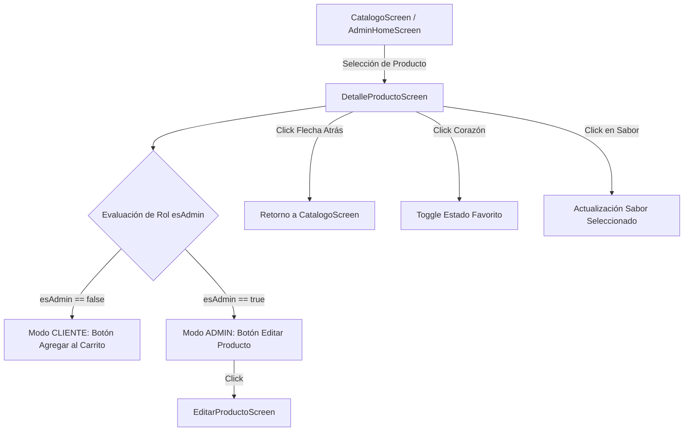

# Especificación Técnica, Ética y UI/UX - Detalle de Producto (`detalle_producto_spec.md`)

| Atributo | Detalle |
| :--- | :--- |
| **Identificador** | `SPEC-VAPEON-DETALLE-001` |
| **Modulo / Pantalla** | `DetalleProductoScreen` |
| **Versión** | `1.0.0` |
| **Estado** | `Aprobado` |
| **Fecha de Publicación** | `2026-10-02` |
| **Plataforma Objetivo** | Android Nativo (Jetpack Compose, Material 3) |
| **Ubicación del Documento** | `doc/specs/detalle_producto_spec.md` |

---

## 1. Resumen Ejecutivo y Alcance

### 1.1 Propósito
La pantalla `DetalleProductoScreen` proporciona una vista completa e interactiva de las características de un vape seleccionado desde el catálogo. Permite a los clientes consultar especificaciones veraces, seleccionar sabores disponibles, marcar el producto como favorito y proceder a la compra, mientras que para los usuarios administradores ofrece un acceso directo a las herramientas de edición de inventario.

### 1.2 Alcance (Scope)
- **In-Scope**:
  - Encabezado personalizado con botón de navegación de regreso (`<-`), título corporativo **VAPEON** e ícono de perfil.
  - Tarjeta de presentación blanca (`24.dp`) con imagen de producto e ícono de favoritos interactivo (corazón).
  - Consulta de datos reales cargados desde Google Cloud Firestore REST API: `nombre`, `marca`, `stock`, `precio`, `descripcion`.
  - Cuadrícula de selección interactiva de sabores por defecto (*Strawberry Watermelon*, *Blue Razz Ice*, *Miami Mint*, *Peach Ice*).
  - Adaptación condicional según el rol del usuario (`CLIENTE` vs `ADMIN`):
    - **CLIENTE**: Muestra el botón *"Agregar al carrito"*.
    - **ADMIN**: Muestra el botón *"Editar Producto"*.
  - Ajuste de márgenes de pantalla con `statusBarsPadding()`.
- **Out-of-Scope**:
  - Persistencia en base de datos local (Room) de la lista de favoritos (se maneja en estado de Compose en v1.0).
  - Selección dinámica de sabores desde Firestore (previsto para v2.0).

---

## 2. Especificación Ética y Cumplimiento Normativo

1. **Transparencia en Precios y Unidades de Stock**:
   - El precio mostrado (`S/{producto.precio}`) y el stock disponible (`Stock: {producto.stock} Unidades`) provienen de la base de datos de inventario sin alteraciones comerciales engañosas.
2. **Protección al Consumidor y Advertencia del Producto**:
   - La ficha descriptiva muestra el contenido y las especificaciones técnicas del dispositivo para garantizar una compra informada por usuarios mayores de edad (+18).
3. **Comercialización Responsable**:
   - Solo los usuarios con rol `CLIENTE` pueden interactuar con las opciones de compra (*Agregar al carrito*), mientras que las acciones de edición quedan reservadas para el rol `ADMIN`.

---

## 3. Especificación Técnica y Arquitectura

### 3.1 Componente Composable
```kotlin
@Composable
fun DetalleProductoScreen(
    producto: Producto,
    esAdmin: Boolean = false,
    volver: () -> Unit,
    irEditarProducto: ((Producto) -> Unit)? = null
)
```

### 3.2 Diagrama de Flujo de Navegación y Estados



### 3.3 Modelo de Datos Utilizado
La pantalla consume directamente la entidad limpia `Producto` ([Producto.kt](file:///d:/AppMovil_VapeOn/app/src/main/java/com/example/vapeon_movil/entities/Producto.kt)):
- `producto.nombre`: Título principal del vape.
- `producto.marca`: Nombre de la marca (*LifePod*, *Oxbar*, *Nexa*).
- `producto.stock`: Cantidad de unidades en existencia.
- `producto.precio`: Valor unitario en Soles (S/).
- `producto.descripcion`: Especificaciones de batería, caladas (puffs) y componentes.

---

## 4. Diseño de Interfaz de Usuario (UI/UX)

- **Fondo de Pantalla**: `VapeOnBackground` (`#0D0E15`) con `statusBarsPadding()`.
- **TopBar**: Flecha atrás (`Icons.AutoMirrored.Filled.ArrowBack`), título `"VAPEON"` en `VapeOnGold` (`#EAA016`), avatar de usuario en `VapeOnRedDark`.
- **Tarjeta de Imagen**: Fondo blanco (`#FFFFFF`), esquinas `24.dp`, logo centrado `R.drawable.logo_vapeon`, botón de corazón interactivo (`Icons.Default.Favorite` en `VapeOnRed` / `Icons.Outlined.FavoriteBorder`).
- **Tarjeta de Precio**: Fondo bronce `VapeOnCardBackground` (`#3F321B`), esquinas `20.dp`.
  - Etiqueta `"Precio Unitario"` y monto grande en negrita `"S/{producto.precio}"`.
  - Botón de acción con estilo píldora (`RoundedCornerShape(50)`).
- **Selector de Sabores**: Fila doble (Grid 2x2) de botones de sabor. El botón seleccionado usa `VapeOnRed` (`#ED2025`) y los inactivos `VapeOnRedDark` (`#5B181C`).

---

## 5. Criterios de Aceptación y Pruebas (BDD)

### Escenario 1: Visualización correcta como Cliente
- **Dado que** un usuario navega al detalle de un producto como `CLIENTE` (`esAdmin = false`).
- **Cuando** la pantalla se compone con la información de Firestore.
- **Entonces** se muestra la tarjeta de imagen, el stock, la marca, el precio y el botón rojo **"Agregar al carrito"**.

### Escenario 2: Visualización correcta como Administrador
- **Dado que** un usuario navega al detalle como `ADMIN` (`esAdmin = true`).
- **Cuando** visualiza la tarjeta de precio.
- **Entonces** se presenta el botón dorado **"Editar Producto"**, y al pulsarlo se redirige a `EditarProductoScreen` precargando los datos del producto.

### Escenario 3: Marcado de Favoritos
- **Dado que** el usuario se encuentra en `DetalleProductoScreen`.
- **Cuando** pulsa el ícono de corazón en la esquina superior derecha de la tarjeta de imagen.
- **Entonces** el ícono cambia su estado visual a corazón relleno en color rojo (`VapeOnRed`).
