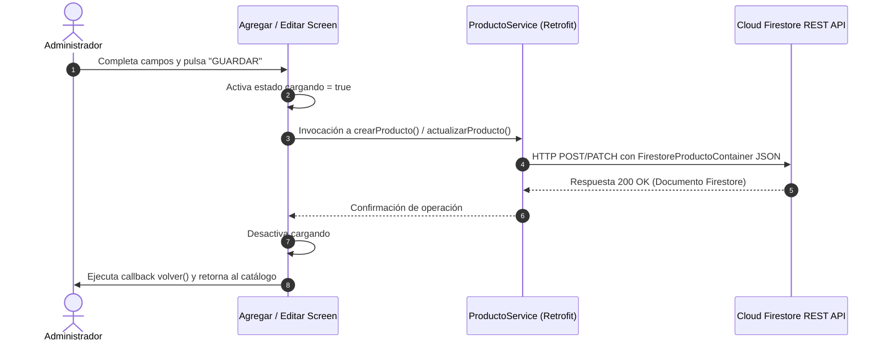

# Especificación Técnica y UI/UX - Gestión de Productos (`gestion_productos_spec.md`)

| Atributo | Detalle |
| :--- | :--- |
| **Identificador** | `SPEC-VAPEON-GESTION-001` |
| **Módulos / Pantallas** | `AgregarProductoScreen`, `EditarProductoScreen` |
| **Versión** | `1.0.0` |
| **Estado** | `Aprobado` |
| **Fecha de Publicación** | `2026-10-02` |
| **Plataforma Objetivo** | Android Nativo (Jetpack Compose, Retrofit) |
| **Ubicación del Documento** | `doc/specs/gestion_productos_spec.md` |

---

## 1. Resumen Ejecutivo y Alcance

### 1.1 Propósito
Las pantallas `AgregarProductoScreen` y `EditarProductoScreen` constituyen el núcleo de administración del inventario de **VapeON Móvil**. Permiten a los usuarios con rol `ADMIN` registrar nuevos dispositivos de vapeo y actualizar datos de vapes existentes directamente en Google Cloud Firestore mediante peticiones REST asíncronas.

### 1.2 Alcance (Scope)
- **In-Scope**:
  - Interfaz gráfica unificada con tema oscuro (`VapeOnBackground`), subtítulos en dorado (`VapeOnGold`) y barras de estado ajustadas (`statusBarsPadding()`).
  - Campos de entrada estilizados (`OutlinedTextField`) con bordes redondeados (`12.dp`) para: *Nombres*, *Marca*, *Precio*, *Stock* y *Descripción*.
  - Precarga de datos en `EditarProductoScreen` a partir del objeto `Producto` seleccionado.
  - Consumo de endpoints REST de Firestore v1:
    - `POST ("productos")`: Creación de un nuevo documento.
    - `PATCH ("productos/{id}")`: Actualización de atributos de un producto existente.
  - Gestión de estado asíncrono con Corrutinas, indicador de carga (`CircularProgressIndicator`) dentro del botón principal y deshabilitación anti-doble clic.
  - Captura y renderizado de errores de conexión HTTP.
- **Out-of-Scope**:
  - Carga masiva mediante archivos CSV o Excel (previsto para v2.0).

---

## 2. Especificación Técnica y Arquitectura

### 2.1 Firmas de Componentes
```kotlin
@Composable
fun AgregarProductoScreen(
    volver: () -> Unit
)

@Composable
fun EditarProductoScreen(
    producto: Producto,
    volver: () -> Unit
)
```

### 2.2 Flujo de Petición HTTP a Firestore REST



---

## 3. Estructura del Formulario y Tokens de UI/UX

- **Márgenes de Pantalla**: `statusBarsPadding()` + `padding(horizontal = 24.dp, vertical = 16.dp)`.
- **TopBar**: Flecha para volver (`IconButton`), título corporativo **"VAPEON"** (`VapeOnGold`), avatar circular del perfil de administrador.
- **Títulos de Pantalla**: **"AGREGAR PRODUCTO"** / **"EDITAR PRODUCTO"** en tipografía blanca grande y en negrita (`24.sp`, `FontWeight.Bold`).
- **Subtítulos sobre TextFields** (en `EditarProductoScreen`):
  - *Nombres del Producto*
  - *Marca*
  - *Precio (S/)*
  - *Stock disponible*
  - *Descripción del producto*
- **Campos de Texto**: `OutlinedTextField` con fondo `#141620`, bordes `#4D3D22`, resalte dorado en foco y esquinas redondeadas `12.dp`.
- **Botón de Acción**: Botón rojo estilo píldora (`VapeOnRed`, `RoundedCornerShape(50)`), de alto `52.dp` con spinner de carga cuando `cargando == true`.

---

## 4. Criterios de Aceptación y Pruebas (BDD)

### Escenario 1: Creación exitosa de producto
- **Dado que** el administrador completa los campos *Nombres*, *Marca*, *Precio*, *Stock* y *Descripción* en `AgregarProductoScreen`.
- **Cuando** pulsa el botón **"GUARDAR PRODUCTO"**.
- **Entonces** el sistema envía una petición `POST` a Firestore, muestra el indicador de carga y retorna automáticamente al catálogo actualizado.

### Escenario 2: Edición exitosa de producto
- **Dado que** el administrador modifica el precio o stock de un producto en `EditarProductoScreen`.
- **Cuando** pulsa el botón **"GUARDAR CAMBIOS"**.
- **Entonces** se ejecuta una petición `PATCH` a `productos/{id}` en Firestore, actualizando el documento y regresando al catálogo.
